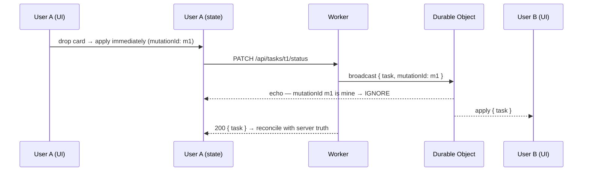

# Design

> Why DevBoard looks and behaves the way it does: principles, screen-by-screen layout, states, motion, and the rules governing optimistic updates and realtime reconciliation.
>
> For the concrete tokens, component API, and a11y checklist, see [docs/design-system.md](./docs/design-system.md). Start at [AGENT.md](./AGENT.md).

**Status:** Specification. Phase 1 built a minimal Navbar (logo + theme toggle only) and a Phase-1-scoped Inspector bar (colo + duration only, no service pills yet); every other screen below — auth, the Kanban board, the task modal, the activity feed, and the full navbar with project switcher/tabs/avatar — is unbuilt.

---

## 1. Principles

### Dense, but calm

A Kanban board is a dashboard: many small units of information competing for the same field of view. The failure mode is a wall of colour-coded chips that is technically informative and practically unreadable.

DevBoard's answer is to make **density the default and emphasis expensive**. Small type (`text-sm` is the workhorse), tight spacing, hairline borders instead of shadows and fills. Emphasis is then available — a filled badge, a weight change — precisely because so little else is competing for it.

### The palette is monochrome on purpose

Every token except `destructive` has zero chroma. This is not a placeholder awaiting a brand colour, and it should not be "fixed" later.

With a grey interface, the only coloured things on screen are the ones that *earned* it: an urgent task, a destructive action. Colour becomes a signal with a fixed, learnable meaning rather than decoration. Introducing a brand accent would immediately dilute that — the accent appears on the logo, then the primary button, then active nav, and within a week red no longer means "look here" because everything is coloured.

The constraint this imposes: **status must be encoded by shape, weight, position, and text — never by hue.** That is a harder design problem and a better interface, and it produces accessibility almost for free.

### Make the edge visible

Most web apps hide their infrastructure. DevBoard's distinguishing decision is the opposite: the Cloudflare Inspector bar renders, continuously, which edge location served you, how long it took, whether the response came from cache, which primitives the request touched, and how far behind the queue is.

This is a first-class product surface, not debug chrome to strip before release. Its design consequence is that **it must be legible without being loud** — permanently present, permanently readable, never competing with the board. It sits in the chrome, uses the smallest type in the system, and animates only on change.

### Optimistic by default, honest about failure

Every mutation renders immediately. A card that moves when you drop it, and *then* saves, is the difference between a tool that feels local and one that feels like a website.

The obligation this creates: when the write fails, say so clearly and put the world back. An optimistic UI that silently diverges from the server is worse than a slow one.

### Never punish the user for the platform

KV is eventually consistent, WebSockets drop, queues lag. None of this is the user's problem. A stale cache shows stale numbers briefly, not an error. A dropped socket shows a quiet reconnecting indicator, not a modal. **The only failure that gets a loud, blocking treatment is a failed durable write** — because that is the only one where the user's work is actually at risk.

---

## 2. Voice

Terse, concrete, no exclamation marks. Sentence case everywhere — never Title Case On Buttons.

| Instead of | Write |
| :--- | :--- |
| "Oops! Something went wrong 😞" | "Couldn't save. Retry?" |
| "Are you sure you want to delete this task?" | "Delete *Fix login redirect*? This can't be undone." |
| "No tasks found in this project!" | "Nothing in To do yet." |
| "Successfully uploaded!" | *(nothing — the badge count incrementing is the confirmation)* |

Buttons name their action: **Create project**, **Delete task**, **Purge cache**. Never "OK", "Submit", or "Yes".

Vocabulary — use these exact words in UI copy, matching the domain model in [docs/product.md](./docs/product.md):

**project**, **task** (never "card" or "ticket" in copy, even though "card" is fine in code), **comment**, **attachment**, **activity**, **member**. Columns are **To do**, **In progress**, **Done**.

For Cloudflare surfaces, use the real product names — **D1**, **KV**, **R2**, **Durable Object**, **Queue**. The Inspector bar is a teaching surface; genericising the names would defeat it.

---

## 3. App shell

```
┌────────────────────────────────────────────────────────────────────────────┐
│ ◆ DevBoard    Acme Redesign ▾              [Board] [Activity]    ◐  ⓐ AB  │  56px  navbar
├────────────────────────────────────────────────────────────────────────────┤
│ ⚡ BOM · 43ms   [D1][KV][R2][DO][Q]   Cache HIT ⟳   ●3 live   Q +1.2s      │  32px  inspector
├──────────────┬─────────────────────────────────────────────────────────────┤
│              │                                                             │
│  PROJECTS    │                                                             │
│  ▸ Acme      │                    main content                             │
│    Internal  │                                                             │
│    Docs      │                                                             │
│              │                                                             │
│  + New       │                                                             │
│              │                                                             │
│  240px       │                                                             │
└──────────────┴─────────────────────────────────────────────────────────────┘
```

| Region | Height / width | Contents |
| :--- | :--- | :--- |
| Navbar | 56 px, `border-b` | Logo, project switcher (`DropdownMenu`), Board/Activity `Tabs`, theme toggle, user avatar menu |
| Inspector bar | 32 px, `bg-muted`, `border-b` | §7 |
| Sidebar | 240 px, `bg-sidebar`, `border-r` | Project list, new-project action |
| Main | fills | Board or Activity |

Below `md` the sidebar collapses into a `Sheet` drawer behind a hamburger; the Inspector bar drops the service pills and keeps colo, duration, and cache.

**No shadows anywhere in the shell.** Separation is hairlines (`border-border`) and, in dark mode, the lightness difference between `--card` and `--background`. Shadows are reserved for genuinely floating layers — dialogs and popovers.

---

## 4. Auth

A centred card at `max-w-sm`, no sidebar, no inspector bar — the Inspector needs a session to say anything interesting, and its absence makes the auth screen feel like a doorway rather than a room.

```
              ┌──────────────────────────────────┐
              │  ◆ DevBoard                      │
              │                                  │
              │  Create your account             │  text-lg font-semibold
              │  Already have one? Sign in       │  text-sm muted-foreground
              │                                  │
              │  Name                            │  text-sm font-medium
              │  ┌────────────────────────────┐  │
              │  └────────────────────────────┘  │
              │  Email                           │
              │  ┌────────────────────────────┐  │
              │  └────────────────────────────┘  │
              │  Password                        │
              │  ┌────────────────────────────┐  │
              │  └────────────────────────────┘  │
              │  At least 8 characters           │  text-xs muted-foreground
              │                                  │
              │  ┌────────────────────────────┐  │
              │  │  Cloudflare Turnstile      │  │  65px reserved, always
              │  └────────────────────────────┘  │
              │                                  │
              │  ┌────────────────────────────┐  │
              │  │      Create account        │  │  Button, w-full
              │  └────────────────────────────┘  │
              └──────────────────────────────────┘
```

**Reserve the Turnstile widget's 65 px from first paint**, even while it loads. A widget that appears late shifts the submit button downward exactly as the user reaches for it.

States: the submit button shows a spinner and stays disabled while in flight; field errors sit below the input in `text-xs text-destructive` with `aria-invalid` on the field; form-level errors (wrong credentials, rate limited) sit above the button in a `bg-destructive/10` block.

**Rate-limited (429) is a distinct state, not a generic error.** Show a live countdown from `Retry-After` — "Too many attempts. Try again in 0:43" — with the button disabled until it reaches zero. Users hitting a limiter are usually legitimate people who mistyped a password twice; tell them exactly when they can try again.

Login failure copy is identical whether the email exists or not: "Email or password is incorrect." This is a security property ([docs/security.md](./docs/security.md#1-threat-model)) that must not be softened by a helpful designer.

---

## 5. Kanban board

```
┌─────────────────────────────────────────────────────────────────────────────┐
│  Acme Redesign                                        [+ New task]          │
│  12 tasks · 3 in progress · 4 members                                       │
├───────────────────────┬───────────────────────┬─────────────────────────────┤
│  ○ To do          5   │  ◐ In progress    3   │  ✓ Done              4      │
│  ─────────────────────│  ─────────────────────│  ───────────────────────────│
│  ┌───────────────────┐│  ┌───────────────────┐│  ┌─────────────────────────┐│
│  │ Fix login redirect││  │ Rework the board  ││  │ ~~Set up D1 schema~~    ││
│  │                   ││  │                   ││  │                         ││
│  │ ⌃ high  📎2  💬3  ││  │  📎1              ││  │  💬1                    ││
│  │              (AB) ││  │              (CD) ││  │                    (AB) ││
│  └───────────────────┘│  └───────────────────┘│  └─────────────────────────┘│
│  ┌───────────────────┐│  ┌───────────────────┐│                             │
│  │ Add rate limiting ││  │ …                 ││                             │
│  └───────────────────┘│  └───────────────────┘│                             │
│                       │                       │                             │
│  + Add task           │                       │                             │
└───────────────────────┴───────────────────────┴─────────────────────────────┘
```

Three fixed columns, equal width, each independently scrollable with a sticky header. Column headers carry an icon, a name, and a count.

### Task card

`bg-card border border-border rounded-lg p-3`, hover raises the border to `--muted-foreground`. No shadow at rest; `shadow-lg` and a 2° rotation while dragging.

| Row | Content |
| :--- | :--- |
| Title | `text-sm font-medium`, up to two lines then truncate. `line-through` + `text-muted-foreground` when done |
| Meta | `text-xs text-muted-foreground` — priority glyph, 📎 count, 💬 count. Zero counts are omitted entirely, not shown as "0" |
| Footer | Assignee `Avatar` (`size-6`), right-aligned. Absent when unassigned — no "unassigned" placeholder |

Card height varies with title length; do not force a fixed height.

### Drag and drop

- Grab anywhere on the card. Cursor `grab` → `grabbing`.
- The origin slot collapses to a 2 px `bg-muted` line; the target column shows an insertion line at the drop index.
- Drop: the card animates into place over 150 ms and the write fires. See §9.
- **Keyboard equivalent, mandatory:** focus a card, <kbd>Space</kbd> to lift, arrows to move between and within columns, <kbd>Space</kbd> to drop, <kbd>Esc</kbd> to cancel. Announced through the live region. A board that can only be operated by mouse is not finished.

### States

| State | Treatment |
| :--- | :--- |
| Loading | Three columns of `Skeleton` cards at plausible heights. Never a centred spinner — a skeleton keeps the layout stable |
| Empty column | `text-xs text-muted-foreground` centred: "Nothing in To do yet." |
| Empty project | Centred block: "No tasks yet" + **Create your first task** |
| Error | Inline in the board area with a **Retry** button. Never a full-page error for a recoverable fetch |
| Offline | Board stays interactive and read-only-ish; a banner says "Offline — changes will not save." Do not blank the screen |

---

## 6. Task modal

`Dialog`, `max-w-2xl`, `rounded-xl`, scrolls internally at small viewport heights.

```
┌──────────────────────────────────────────────────────────────┐
│  Fix login redirect                                    ✕     │  text-lg, click to edit
│  In progress · high · AB · due Fri                           │  text-xs muted
├──────────────────────────────────────────────────────────────┤
│  Description                                                 │
│  ┌────────────────────────────────────────────────────────┐  │
│  │ Redirect loops when the JWT expires mid-session.       │  │  click to edit
│  └────────────────────────────────────────────────────────┘  │
│                                                              │
│  Attachments (2)                              [+ Add file]   │
│  ┌────────────────────────────────────────────────────────┐  │
│  │ 📄 screenshot.png      142 KB      ↓   ✕               │  │
│  │ 📄 trace.txt            8 KB       ↓   ✕               │  │
│  │ 📄 upload.pdf          ▓▓▓▓▓▓░░░░ 62%                  │  │  in flight
│  └────────────────────────────────────────────────────────┘  │
│                                                              │
│  Comments (3)                                                │
│  (AB) Alice · 2h ago                                         │
│       Reproduced on staging.                                 │
│  (CD) Dana · 30m ago                                         │
│       Fix is in the auth middleware.                         │
│                                                              │
│  ┌────────────────────────────────────────────────────────┐  │
│  │ Write a comment…                                       │  │
│  └────────────────────────────────────────────────────────┘  │
│                                              [Comment]       │
└──────────────────────────────────────────────────────────────┘
```

**Editing is inline, not modal-within-modal.** Click the title or description; it becomes an input in place. <kbd>Enter</kbd> (or blur) saves, <kbd>Esc</kbd> cancels. No Edit button, no Save button, no second dialog.

**Uploads.** Drag a file anywhere onto the modal, or use the button. The row appears immediately with a `Progress` bar; on success it becomes a normal row. On failure it turns `bg-destructive/10` with a **Retry** action and the reason ("Too large — 10 MB maximum", "File type not allowed"). Client-side size and type checks run first so obvious rejections are instant, but the server rejects independently.

**Comments** are oldest-first with the composer at the bottom, like a conversation. <kbd>⌘/Ctrl+Enter</kbd> submits. Optimistically appended at 60% opacity until confirmed.

**Deleting** anything uses an `AlertDialog` naming the specific thing: "Delete *Fix login redirect*? This can't be undone."

---

## 7. The Cloudflare Inspector bar

The product's signature surface. 32 px, `bg-muted`, `text-xs`, horizontally scrollable on narrow screens.

```
⚡ BOM · 43ms  │  [D1 12ms] [KV] [R2] [DO] [Q]  │  Cache HIT ⟳  │  ● 3 live  │  Q +1.2s
```

| Segment | Shows | Detail on hover |
| :--- | :--- | :--- |
| **Colo** | `⚡ BOM` — the edge location that served you. `LOCAL` in dev | "Served from Mumbai. Your code runs in 300+ locations; requests reach the nearest one." |
| **Duration** | Total round trip, `tabular-nums` | Breakdown: worker time vs D1 time |
| **Service pills** | D1 · KV · R2 · DO · Q — filled when the last request touched them, pulsing briefly on change | What each primitive did for this request |
| **Cache** | `HIT` filled / `MISS` outlined / `BYPASS` dashed, plus a ⟳ **Purge** button | "Served from KV in 4 ms" or "Computed from D1 in 38 ms, cached for 60 s" |
| **Presence** | `● 3 live` — connected members. Amber dot while reconnecting, hollow when offline | Who is on the board |
| **Queue lag** | `Q +1.2s` — most recent `processed_at − occurred_at` | "The last activity took 1.2 s to process asynchronously" |

Design rules:

- **Never let it jump.** Fixed-width slots and `tabular-nums`; a number that changes must not reflow its neighbours.
- **Animate only on change.** A 400 ms pulse when a pill activates, nothing at rest. A permanently animating bar is a permanent distraction.
- **The Purge button is real.** Clicking it calls `POST /api/projects/:id/cache/purge` and the pill visibly returns to `MISS` on the next load. This is the interaction that teaches cache invalidation better than any amount of prose.
- **Every segment has a tooltip that explains the concept**, not just the value. The bar is the app's teaching surface; the tooltips are the lesson.
- `LOCAL` in the colo slot is normal in development, not an error state. Style it `muted`, not destructive.

---

## 8. Activity feed

A tab beside Board (and a right rail at `lg` and wider).

```
┌───────────────────────────────────────────────────────────┐
│  Activity                                                 │
├───────────────────────────────────────────────────────────┤
│  (AB) Alice moved Fix login redirect to Done              │
│       2m ago  ·  ⟳ via Cloudflare Queue  ·  +0.8s         │
│                                                           │
│  (CD) Dana commented on Rework the board                  │
│       5m ago  ·  ⟳ via Cloudflare Queue  ·  +1.4s         │
│                                                           │
│  (AB) Alice uploaded screenshot.png                       │
│       12m ago  ·  ⟳ via Cloudflare Queue  ·  +0.9s        │
└───────────────────────────────────────────────────────────┘
```

Newest first, cursor-paginated, infinite scroll. Each entry: avatar, a sentence naming actor and object, relative time, the **via Cloudflare Queue** badge, and its individual latency.

**Entries arrive late, and that is the feature.** When you move a card, the board updates instantly and the feed entry appears a second or two later — sliding in with a 200 ms fade. That visible gap is the clearest possible demonstration of what a queue does, so do not smooth it over by writing the activity synchronously.

Empty state: "Nothing yet. Actions on this board will show up here."

---

## 9. Optimistic updates and realtime reconciliation

Two systems mutate the same state — the local optimistic update and the incoming WebSocket broadcast. They must be specified together or they will fight.



### The rules

1. **Apply locally first.** Never wait for the server to render a user's own action.
2. **Every mutation carries a client-generated `mutationId`**, round-tripped through the API and into the broadcast.
3. **Ignore the echo of your own mutation.** Without this the mutating client applies its own change twice and the card visibly flickers.
4. **On success, reconcile with the server's response** rather than keeping the optimistic guess. The server owns `updated_at` and may have adjusted `position`.
5. **On failure, roll back and say so.** Animate the card back to its origin over 200 ms and show a toast: "Couldn't move *Fix login redirect*. Retry?" A silent rollback looks like a bug in the drag handler.
6. **Last-write-wins on `updated_at`.** An incoming broadcast older than local state is dropped.
7. **If an incoming change overwrites an active local edit**, apply it and warn: "Dana updated this task while you were editing." Never discard the remote change, and never let it silently eat typed text — this is the one case where interrupting is correct.

### Connection states

| State | Treatment |
| :--- | :--- |
| Connected | `● N live` in the Inspector bar. No other chrome |
| Reconnecting | Amber dot, "reconnecting". Board stays fully interactive — writes still go over HTTP, which is a separate channel |
| Offline (backoff exhausted) | Hollow dot, "offline". A dismissible banner: "Live updates paused. Reload to reconnect." |
| Reconnected | Refetch board state and diff. If anything changed while away, a toast: "Board updated while you were away." |

Backoff: 1 s, 2 s, 4 s, 8 s, 16 s, 30 s, then every 30 s, with jitter. Reset on a successful open.

**A dead WebSocket must never block a write.** Realtime is an enhancement layered on top of a working HTTP app, and every state above keeps the board usable.

---

## 10. Motion

Fast, small, purposeful. Every duration below 250 ms.

| Interaction | Duration | Easing |
| :--- | ---: | :--- |
| Hover / focus | 120 ms | `ease-out` |
| Button press | 80 ms | `ease-out` (a 1 px translate) |
| Card drop into place | 150 ms | `ease-out` |
| Card rollback on failure | 200 ms | `ease-in-out` — deliberately slower, so the failure registers |
| Dialog open | 200 ms | `ease-out`, fade + 4 px rise |
| Dialog close | 150 ms | `ease-in` |
| Toast in | 200 ms | `ease-out`, slide from the edge |
| Activity entry in | 200 ms | `ease-out`, fade + slide |
| Inspector pill pulse | 400 ms | Once, on change |
| Skeleton shimmer | 1.5 s | Looping, the only continuous animation permitted |

Rules:

- **Animate `transform` and `opacity` only.** Animating `width`, `height`, `top`, or `left` causes layout and drops frames on a busy board.
- **Realtime changes from other users animate; your own do not.** Yours already happened as a direct result of your action; theirs need to attract attention.
- **Nothing loops except the skeleton shimmer.**
- **`prefers-reduced-motion` removes transitions entirely** — states still change instantly, nothing is lost, nothing moves.

```css
@media (prefers-reduced-motion: reduce) {
  *, *::before, *::after {
    animation-duration: 0.01ms !important;
    animation-iteration-count: 1 !important;
    transition-duration: 0.01ms !important;
  }
}
```

---

## 11. Every surface needs five states

Design all of them before building any of them. The default state is the easy one and the least often seen.

| State | Rule |
| :--- | :--- |
| **Loading** | Skeletons matching the real layout's shape. No centred spinners, no layout shift on arrival |
| **Empty** | One line of plain explanation plus the action that fills it. Never an illustration, never an exclamation mark |
| **Error** | Scoped to the failed region, not the page. Says what failed and offers a retry |
| **Partial** | Some data arrived, some did not — render what you have, mark the rest. A stats card can fail while the board loads fine |
| **Offline** | The app stays visible and navigable. A banner explains; writes are blocked with an explanation, not a generic failure |

---

## 12. Responsive

| Width | Layout |
| :--- | :--- |
| < 640 px | Single column. Sidebar in a `Sheet`. Kanban columns stack vertically with sticky headers. Inspector bar shows colo + duration + cache only. Task modal is full-screen |
| 640–767 px | Two Kanban columns visible, horizontal scroll for the third |
| 768–1023 px | Persistent sidebar. All three columns, narrow |
| ≥ 1024 px | Full layout. Activity as a right rail alongside the board |
| ≥ 1280 px | Wider columns, same structure. No new layout |

Mobile is a genuine use case — checking a board on a phone is common; dragging cards on one is not. On touch layouts, the card's overflow menu with "Move to →" is the primary status-change affordance, and drag is a bonus.

Touch targets ≥ 44 px. The `xs` button sizes are desktop-chrome only.

---

## 13. What we are deliberately not doing

| Not doing | Why |
| :--- | :--- |
| A brand accent colour | Would dilute the meaning of the two colours that carry signal (§1) |
| Shadows for elevation in the shell | Hairlines and lightness are quieter and sufficient. Shadows only on floating layers |
| Illustrations in empty states | A sentence and a button are faster to read and never feel patronising |
| Confetti, celebration animation | Completing a task is a Tuesday, not an achievement |
| Avatar photo uploads | Initials on `--muted` plus a per-user colour. Avoids an entire upload/moderation surface |
| Custom scrollbars | Native scrollbars are accessible and familiar |
| A splash screen | The shell renders instantly; content streams in as skeletons |
| Onboarding tour | The Inspector-bar tooltips are the tour, in context, when relevant |
