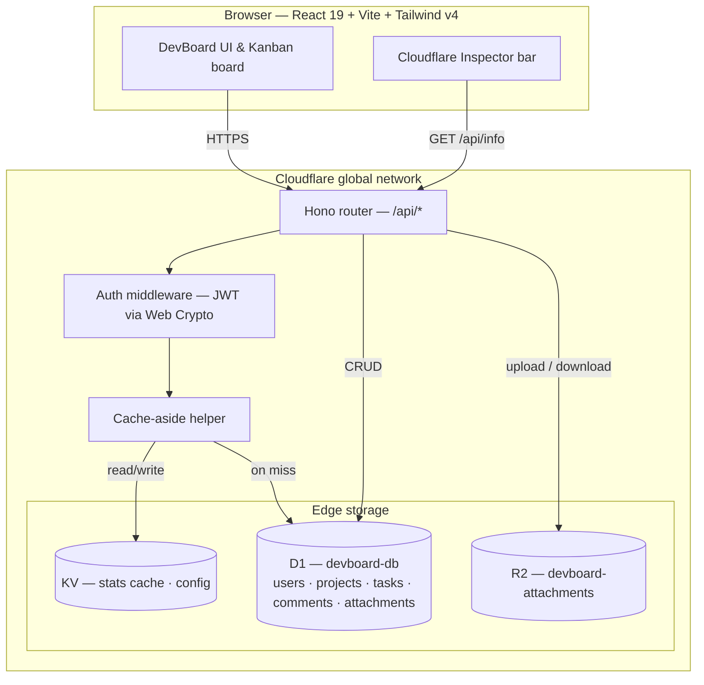

# DevBoard

A Kanban task manager for small dev teams — and a from-scratch tour of nine Cloudflare edge primitives, built one working phase at a time.

> **Where this stands right now:** Phases 0–4 are built and verified (frontend shell, Workers API, D1-backed auth/projects/tasks, R2 attachments, KV caching). Phases 5–8 (Durable Objects realtime, Queues activity feed, Turnstile/WAF, production deploy) are specified but not yet built. Sections below are marked **Built** or **Planned** accordingly — nothing here describes a feature as working that isn't.

---

## Table of contents

1. [What this is](#1-what-this-is)
2. [Why Cloudflare, primitive by primitive](#2-why-cloudflare-primitive-by-primitive)
3. [Build status](#3-build-status)
4. [Tech stack](#4-tech-stack)
5. [Architecture](#5-architecture)
6. [Project structure](#6-project-structure)
7. [Getting started](#7-getting-started)
8. [Environment variables & secrets](#8-environment-variables--secrets)
9. [Available commands](#9-available-commands)
10. [Database schema](#10-database-schema)
11. [API surface](#11-api-surface)
12. [Caching (KV)](#12-caching-kv)
13. [Security model](#13-security-model)
14. [The Cloudflare Inspector bar](#14-the-cloudflare-inspector-bar)
15. [Testing](#15-testing)
16. [Design system](#16-design-system)
17. [Deployment (planned — Phase 8)](#17-deployment-planned--phase-8)
18. [Documentation index & contributing](#18-documentation-index--contributing)

---

## 1. What this is

DevBoard is a Kanban board: projects, tasks in three columns (`todo` / `in_progress` / `done`), comments, file attachments, and — once later phases land — live multi-user collaboration and an activity feed.

It's also, deliberately, a way to learn Cloudflare's serverless platform end to end by building something that actually needs each piece:

| A Kanban board needs… | …which forces you to learn |
| :--- | :--- |
| Users, projects, tasks, relations | **D1** — relational SQL with foreign keys and migrations |
| File attachments on tasks | **R2** — blob storage, and why it stays out of the database |
| A dashboard everyone loads constantly | **KV** — cache-aside, TTLs, and invalidation you have to get right |
| Two people watching the same board | **Durable Objects** *(planned)* — the only way stateless Workers coordinate a WebSocket |
| An activity feed that can't slow the UI | **Queues** *(planned)* — producer/consumer, batching, retries, dead letters |
| Public signup and login forms | **Turnstile** + rate limiting *(planned)* — abuse protection before business logic |
| To exist on the internet | **Workers**, **DNS/CDN/SSL**, and a real deploy *(planned)* |

No Cloudflare API is ever hidden behind a generic wrapper. If a route calls `env.DB` or `env.KV`, you see that call in the route file, not in an abstraction three layers down. That's a hard rule in this repo — see [AGENT.md](./AGENT.md) §1.

Full product spec, personas, and non-goals: [docs/product.md](./docs/product.md).

---

## 2. Why Cloudflare, primitive by primitive

| Service | Role in DevBoard | Status |
| :--- | :--- | :---: |
| **Workers** | The whole application — API, static asset host, (later) WebSocket gateway | Built |
| **D1** | Primary relational database — users, projects, tasks, comments, attachments metadata | Built |
| **R2** | Attachment bytes, zero egress fees, kept out of the relational database | Built |
| **KV** | Derived caches (project stats), edge config, (later) rate-limit counters | Built |
| **Durable Objects** | `RealtimeBoard` — one globally-addressable actor per project for live collaboration | Planned (Phase 5) |
| **Queues** | Decouples the activity feed from the request path — batching, retries, dead letters | Planned (Phase 6) |
| **Turnstile** | Bot protection on register/login | Planned (Phase 7) |
| **WAF / Rate Limiting** | Edge abuse protection layered with an app-level KV limiter | Planned (Phase 7) |
| **DNS / CDN / SSL** | Custom domain, TLS, HTTP/3, a real `wrangler deploy` | Planned (Phase 8) |

Full decision rationale for each: [docs/architecture.md](./docs/architecture.md) §2.

---

## 3. Build status

| # | Phase | Primitive | Status |
| :---: | :--- | :--- | :--- |
| 0 | Frontend scaffold | — | ✅ Done |
| 1 | Worker, router, app shell | Workers | ✅ Done |
| 2 | Database, auth, tasks CRUD | D1 | ✅ Done |
| 3 | File attachments | R2 | ✅ Done |
| 4 | Caching & edge config | KV | ✅ Done |
| 5 | Realtime collaboration | Durable Objects | ⬜ Not started |
| 6 | Activity feed | Queues | ⬜ Not started |
| 7 | Bot protection & rate limiting | Turnstile / WAF | ⬜ Not started |
| 8 | Production deployment | DNS / CDN / SSL | ⬜ Not started |

"Done" here means: the automated gates in [§15](#15-testing) pass and the backend is verified via integration tests against real Miniflare bindings. The one thing not yet run for Phases 2–4 is a manual pass through an actual browser (this repo's automated tooling doesn't drive one) — see each phase's manual script in [docs/testing.md](./docs/testing.md#10-manual-test-scripts).

Full phase breakdown — deliverables, exit criteria, dependency graph, known hard parts: [docs/roadmap.md](./docs/roadmap.md).

---

## 4. Tech stack

**Frontend** — React 19, TypeScript 6, Vite 8, Tailwind v4 (CSS-first config, no `tailwind.config.js`), shadcn (`radix-luma` style, `neutral` base), `react-router` for client routing, `zustand` for the auth session, `zod` for form/request validation, `@dnd-kit` for drag-and-drop, Sonner for toasts.

**Backend** — a single Cloudflare Worker, [Hono](https://hono.dev) as the router, hand-rolled JWT (HS256 via Web Crypto, no library) and PBKDF2 password hashing, `zod` schemas shared in spirit (not import) between client and Worker.

**Data** — D1 (SQLite at the edge) for everything relational, R2 for attachment bytes, KV for derived caches and config.

**Tooling** — oxlint, vitest + `@cloudflare/vitest-pool-workers` (tests run against real Miniflare-emulated bindings, not mocks), Wrangler v4.

Exact versions: [package.json](./package.json).

---

## 5. Architecture

DevBoard is **one Cloudflare Worker** — not a frontend host plus a separate API host. One deployable unit serves the React bundle, the REST API, and (from Phase 5) the WebSocket upgrade, from every Cloudflare edge location. There is no origin server: nothing here runs in a datacenter you chose.



The full diagram — including the Durable Object, Queue, Turnstile, and WAF paths that later phases add — is in [docs/architecture.md](./docs/architecture.md) §1.

**The house route pattern** every mutating route follows: **validate → authorize → durable write (D1) → invalidate (KV) → enqueue (Queue, once Phase 6 exists) → broadcast (DO, once Phase 5 exists)**. See [AGENT.md](./AGENT.md) §6 for a worked example.

---

## 6. Project structure

```
dev-board/
├── worker/                       # Cloudflare Worker — the entire backend
│   ├── index.ts                  # Hono app: CORS, timing, onError, route mounts
│   ├── env.ts                    # Env bindings + Hono Variables types
│   ├── routes/
│   │   ├── auth.ts               # register / login
│   │   ├── projects.ts           # projects CRUD, members, KV-cached stats, cache purge
│   │   ├── tasks.ts              # tasks CRUD, status/position, comments
│   │   ├── attachments.ts        # R2 upload / download / delete
│   │   └── config.ts             # public GET /api/config (KV-backed)
│   ├── middleware/auth.ts        # JWT verification
│   ├── lib/
│   │   ├── jwt.ts, password.ts   # HS256 sign/verify, PBKDF2 hash/verify — Web Crypto only
│   │   ├── authz.ts              # assertMembership / assertTaskMembership
│   │   ├── position.ts           # fractional-indexing helpers for drag-and-drop
│   │   ├── cache.ts               # cacheAside() — HIT/MISS/BYPASS
│   │   ├── cache-keys.ts          # every KV key built in one place
│   │   ├── schemas.ts             # zod request-body schemas
│   │   └── errors.ts              # ApiError + JSON error envelope
│   └── db/
│       ├── migrations/            # append-only, numbered SQL migrations
│       └── seed.sql
├── src/                           # Frontend
│   ├── App.tsx                    # react-router routes, auth guards, shell layout
│   ├── api/client.ts               # typed fetch wrapper, X-DevBoard-* header store
│   ├── hooks/                      # useAuth, useProjects, useTasks, useComments, useMembers, useAttachments
│   ├── stores/auth-store.ts        # zustand — session/token persistence
│   ├── components/
│   │   ├── layout/                 # Navbar, Sidebar, CloudflareBar (the Inspector bar)
│   │   ├── kanban/                 # Board, TaskCard, TaskModal
│   │   ├── auth/                   # LoginForm, RegisterForm
│   │   └── ui/                     # shadcn primitives (button, dialog, tabs, …)
│   └── lib/                        # schemas.ts, position.ts (mirrors the worker/lib versions), utils.ts
├── test/
│   ├── integration/                # route tests against real D1/R2/KV via Miniflare
│   ├── unit/                       # jwt, password, position
│   ├── helpers.ts                  # seedUser / seedProject / apiRequest
│   └── setup.ts                    # applies D1 migrations before the suite runs
├── docs/                           # the full specification — see §18
├── wrangler.jsonc                  # Worker config: bindings, compatibility date
└── vite.config.ts                  # dev server, proxies /api and /ws to :8787
```

`worker/durable-objects/`, `worker/queue/`, `worker/middleware/rate-limit.ts`, `worker/middleware/turnstile.ts`, and their frontend counterparts (`useRealtime.ts`, `ActivityFeed.tsx`) don't exist yet — they arrive in Phases 5–7. Don't import from them.

---

## 7. Getting started

```bash
git clone <this-repo>
cd dev-board
npm install

# One-time: authenticate Wrangler and provision the D1/R2/KV resources this
# repo needs, then paste the resulting ids into wrangler.jsonc. Full steps:
# docs/deployment.md §5. Or, for pure local dev, the placeholder ids already
# in wrangler.jsonc are enough — Miniflare doesn't validate them.

npx wrangler d1 migrations apply devboard-db --local   # or: npm run db:migrate

# Terminal 1
npm run worker:dev     # Worker API on :8787

# Terminal 2
npm run dev            # Vite dev server on :5173, proxies /api and /ws to :8787
```

Open `http://localhost:5173`. Register an account, create a project, drag some cards.

---

## 8. Environment variables & secrets

Non-secret config lives in `wrangler.jsonc`'s `vars`. Secrets never do — they go through `wrangler secret put` in production and a gitignored `.dev.vars` locally:

```bash
# .dev.vars (create this yourself — it's gitignored, never committed)
JWT_SECRET=<any long random string for local dev>
```

Without `JWT_SECRET` set locally, registration and login will fail (HMAC key import throws). `TURNSTILE_SECRET_KEY` is required starting Phase 7. Full secret list and provisioning commands: [docs/deployment.md](./docs/deployment.md) §5, §12.

---

## 9. Available commands

| Command | Does |
| :--- | :--- |
| `npm run dev` | Vite dev server, `:5173` |
| `npm run build` | `tsc -b && vite build` — typechecks and builds `src/` to `./dist` |
| `npm run lint` | oxlint |
| `npm run preview` | Preview the production build |
| `npm run worker:dev` | `wrangler dev` — Worker API on `:8787` |
| `npm run worker:check` | `tsc -p tsconfig.worker.json --noEmit` — typechecks `worker/` (no DOM lib, catches Node-API misuse) |
| `npm run cf-typegen` | Regenerates `worker-configuration.d.ts` from `wrangler.jsonc` — run after any binding change, then commit the file |
| `npm run db:migrate` | Applies D1 migrations locally |
| `npm run db:seed` | Loads `worker/db/seed.sql` into the local D1 |
| `npm test` | Runs the vitest suite (unit + integration, against real Miniflare bindings) |
| `npm run test:watch` | Same, in watch mode |

`npm run build` and `npm run worker:check` are both required before calling any change done — they compile different trees (`src/` has DOM, `worker/` deliberately doesn't) and neither substitutes for the other.

---

## 10. Database schema

Five D1 tables so far, all `snake_case`, all timestamps Unix seconds:

- **`users`** — email, display name, PBKDF2 hash + salt, avatar color
- **`projects`** — name, slug, description, color, owner, archived_at
- **`project_members`** — `(project_id, user_id, role)`; role ∈ `owner` / `admin` / `member` / `viewer`. Every authorization check reads this table
- **`tasks`** — title, description, status (`todo`/`in_progress`/`done`), priority, a fractional-index `position` for ordering, assignee, due date
- **`comments`** — plain-text notes on a task
- **`attachments`** — metadata only (filename, size, MIME type, R2 key); bytes live in R2, never in D1

`activities` (Phase 6) isn't created yet. Full DDL, indexes, and the R2 key-naming scheme: [docs/database.md](./docs/database.md).

---

## 11. API surface

All routes are mounted under `/api`. Every project- or task-scoped route resolves membership in one query and returns **404, not 403,** to a non-member — existence-oracle leaks are treated as a real vulnerability here (see [AGENT.md](./AGENT.md) rule 13).

| Method | Path | Auth | Notes |
| :--- | :--- | :---: | :--- |
| `GET` | `/api/health`, `/api/info` | – | Liveness + edge metadata for the Inspector bar |
| `GET` | `/api/config` | – | Reads `config:*` from KV; sensible defaults if unset |
| `POST` | `/api/auth/register`, `/api/auth/login` | – | Returns a JWT |
| `GET/POST/PATCH/DELETE` | `/api/projects`, `/api/projects/:id` | ✓ | CRUD; delete requires `owner` |
| `GET` | `/api/projects/:id/members` | ✓ | Resolves assignee ids to names/avatars |
| `GET` | `/api/projects/:id/stats` | ✓ | KV cache-aside; sets `X-DevBoard-Cache: HIT\|MISS\|BYPASS` |
| `POST` | `/api/projects/:id/cache/purge` | ✓ | Forces the next stats read to recompute |
| `GET/POST` | `/api/projects/:id/tasks` | ✓ | List / create |
| `GET/PATCH/DELETE` | `/api/tasks/:id`, `/api/tasks/:id/status` | ✓ | Edit, move, delete |
| `GET/POST` | `/api/tasks/:id/comments`, `DELETE /api/comments/:id` | ✓ | Author or `admin`+ can delete |
| `GET/POST` | `/api/tasks/:id/attachments` | ✓ | List / streamed upload, 10 MB cap, MIME allow-list, no SVG |
| `GET` | `/api/attachments/:id/download` | ✓ | `Content-Disposition: attachment` |
| `DELETE` | `/api/attachments/:id` | ✓ | Uploader or `admin`+; removes R2 object and D1 row |

Full request/response shapes, sequence diagrams, and the Phase 5–7 routes not built yet: [docs/architecture.md](./docs/architecture.md) §7.

---

## 12. Caching (KV)

Cache-aside on the one thing worth caching so far: project stats (task counts by status, comment count, attachment bytes, member count). A request either hits KV (`~6ms`) or misses and recomputes from a single batched D1 query (`~45ms`), writing the result back to KV via `ctx.waitUntil` so the cache write never costs the requester latency.

- **Key registry:** `worker/lib/cache-keys.ts` — every key built in one place, never inlined at a call site
- **TTL:** 60 seconds
- **Invalidation:** any task/comment/attachment mutation in that project, or the manual `POST /:id/cache/purge`
- **Failure mode:** if KV itself is unreachable, the read is wrapped in try/catch and degrades to `BYPASS` — a cache outage never becomes a 500
- **Visibility:** the Inspector bar's cache pill and Purge button — see [§14](#14-the-cloudflare-inspector-bar)

Full key inventory (including the `config:*` and future `ratelimit:*` prefixes) and the eventual-consistency tradeoff this accepts: [docs/database.md](./docs/database.md) §9.

---

## 13. Security model

- **Passwords** — PBKDF2 via `crypto.subtle`, per-user salt, never logged
- **Sessions** — hand-rolled HS256 JWT, verified on every request (signature, expiry, `alg`)
- **Authorization** — one function, `assertMembership`/`assertTaskMembership`, used on every project- or task-scoped route; a role table (`viewer < member < admin < owner`) gates every mutation
- **Uploads** — 10 MB cap, MIME allow-list, SVG explicitly rejected, `Content-Disposition: attachment` enforced (treated as a security control, not a convenience)
- **Non-members get 404, never 403**
- **Not yet built:** Turnstile bot-protection, rate limiting, and CSP/security headers (Phase 7); email verification, password reset, and MFA are deliberate, catalogued gaps

Full threat model, deliberate gaps, and the pre-deploy checklist: [docs/security.md](./docs/security.md).

---

## 14. The Cloudflare Inspector bar

A persistent bar in the app chrome that renders the platform's normally-invisible behavior, live:

- the **edge colo** that served the request (`BOM`, `SIN`… or `LOCAL` in dev)
- **round-trip duration**
- a **cache pill** (`HIT` / `MISS` / `BYPASS`) with a working **Purge cache** button
- *(planned)* service pills for D1/KV/R2/DO/Queue, WebSocket connection state, and queue lag

This isn't debug chrome meant to be stripped before release — it's the point. Dragging a card and watching the cache pill go dark on invalidation teaches the architecture by using the app. Fed by the `X-DevBoard-*` response headers (`docs/architecture.md` §7); visual spec in [DESIGN.md](./DESIGN.md).

---

## 15. Testing

```bash
npm run lint          # oxlint
npm run build          # typechecks + builds src/
npm run worker:check   # typechecks worker/ (no DOM lib)
npm test               # vitest — unit + integration
```

Integration tests run against **real** D1/R2/KV bindings via `@cloudflare/vitest-pool-workers` and Miniflare — never mocks — so a passing suite means the actual SQL, the actual bucket, the actual cache-aside logic ran. Every mutating route's test coverage includes the non-member-gets-404 case and, from Phase 4 on, a cache-invalidation assertion.

What automated tests can't cover — cross-window realtime, visible queue lag, CSP behavior in a real browser — is written up as manual scripts M1–M9, one per phase, in [docs/testing.md](./docs/testing.md) §10. These haven't been run in this environment (no connected browser) and are the one open item on each completed phase.

---

## 16. Design system

Tailwind v4, CSS-first (`src/index.css` *is* the config — there's deliberately no `tailwind.config.js`). shadcn (`radix-luma` style, `neutral` base). Every color is a semantic token (`bg-muted`, `text-destructive`, never `bg-neutral-100`) so dark mode isn't a separate implementation. Component pattern: `cva` for variants, `data-slot`/`data-variant`/`data-size` on the root element, named exports, no `forwardRef` (React 19 passes `ref` as a prop).

Full token set, accessibility rules, and the house component pattern worked example: [docs/design-system.md](./docs/design-system.md).

---

## 17. Deployment (planned — Phase 8)

Not live yet. When Phase 8 lands, this section becomes real steps rather than a preview; the plan already written is:

- `assets` binding (`./dist`, SPA fallback) so one `wrangler deploy` ships frontend and API atomically
- Separate `env.staging` / `env.production`, each with its own D1/R2/KV/secrets — never sharing production data with a staging deploy
- Custom domain, Full (strict) SSL, HTTP/3, a cache rule bypassing `/api/*`
- `wrangler rollback`, verified before it's ever needed

Full provisioning commands, the deploy sequence, environments, and the pre-launch checklist: [docs/deployment.md](./docs/deployment.md).

---

## 18. Documentation index & contributing

| Doc | Read it for |
| :--- | :--- |
| [AGENT.md](./AGENT.md) | The operating manual — hard rules, conventions, house patterns. Read this first if you're changing code |
| [docs/product.md](./docs/product.md) | What DevBoard is for, personas, non-goals, acceptance criteria per phase |
| [docs/architecture.md](./docs/architecture.md) | Full request lifecycle, the `Env` shape, the complete API surface |
| [docs/database.md](./docs/database.md) | Schema, migrations, KV keys, R2 key layout — source of truth for all data stores |
| [docs/security.md](./docs/security.md) | Auth, authorization, upload security, secrets, the threat model |
| [docs/testing.md](./docs/testing.md) | Test stack, integration test patterns, manual scripts M1–M9 |
| [docs/deployment.md](./docs/deployment.md) | Local setup, provisioning, deploying, rollback |
| [docs/roadmap.md](./docs/roadmap.md) | Phase-by-phase deliverables, exit criteria, dependency graph, where this gets hard |
| [docs/design-system.md](./docs/design-system.md) | Tokens, components, accessibility |
| [DESIGN.md](./DESIGN.md) | Screen-by-screen layout, states, motion, optimistic/realtime reconciliation |

**Contributing:** this is a personal learning project, not currently accepting outside contributions. If you're extending it yourself: read AGENT.md in full before touching anything, work one phase at a time per the roadmap, and update the relevant doc in the same commit as the code — the docs are treated as the spec, and a silent divergence is worse than no doc at all.

No license file yet; treat as all-rights-reserved until one is added.
