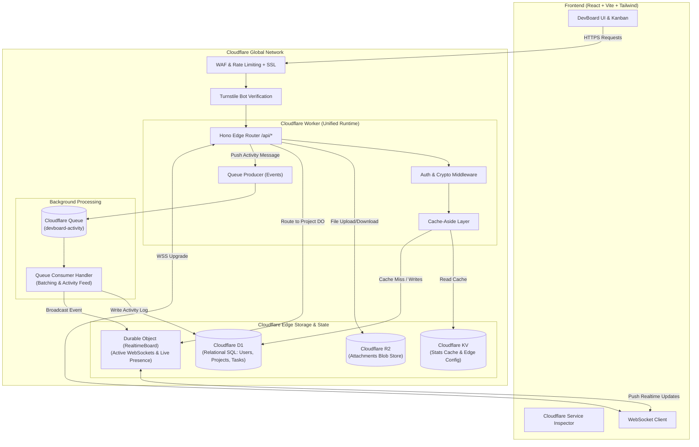

# DevBoard: Cloudflare Full-Stack Architecture & Implementation Plan

## Goal Description
Build **DevBoard**, a production-grade yet educational full-stack developer task management application designed specifically to master Cloudflare's serverless ecosystem.

The application incorporates nine core Cloudflare capabilities:
1. **Cloudflare Workers** (Edge compute & REST API)
2. **Cloudflare D1** (Serverless relational SQLite database at the edge)
3. **Cloudflare R2** (Zero-egress object storage for file attachments)
4. **Cloudflare KV** (Low-latency global key-value store for caching & config)
5. **Cloudflare Durable Objects** (Stateful, strongly consistent WebSockets coordination for real-time collaboration)
6. **Cloudflare Queues** (Asynchronous background event processing & activity feeds)
7. **Cloudflare Turnstile** (Privacy-preserving bot protection)
8. **Cloudflare WAF / Rate Limiting** (Edge abuse protection & request filtering)
9. **Cloudflare DNS / CDN / SSL** (Production deployment, edge caching, and HTTPS)

Each service will be implemented cleanly without hiding Cloudflare-specific concepts, backed by inline educational explanations, an interactive in-app Cloudflare Architecture Inspector, and a comprehensive 18-section README.

---

## High-Level Architecture Diagram



---

## Cloudflare Services: Purpose & Interaction Matrix

| Cloudflare Service | Role in DevBoard | Problem It Solves | How It Communicates |
| :--- | :--- | :--- | :--- |
| **Workers** | API & Application Core | Replaces heavy traditional backend servers with instant-startup, globally distributed V8 isolates. | Direct entrypoint via `fetch(request, env, ctx)`. Accesses all other bindings on `env`. |
| **D1** | Primary Database | Provides ACID-compliant relational SQL storage with foreign keys and migrations at the edge. | `env.DB.prepare().bind().run()` / `env.DB.batch()` directly from Workers. |
| **R2** | File Attachments | Eliminates AWS S3 egress fees and stores task screenshots/docs cleanly separated from SQL. | Direct streaming via `env.BUCKET.put()` and `env.BUCKET.get()`. |
| **KV** | Fast Caching & App Config | Caches high-traffic dashboard stats and stores dynamic feature flags with sub-10ms global edge read latency. | `env.KV.get()` and `env.KV.put(key, value, { expirationTtl: 300 })`. |
| **Durable Objects** | Real-Time Sync & WebSockets | Solves the stateless nature of Workers. Provides a single stateful, globally coordinated actor for live collaboration. | `env.REALTIME_BOARD.idFromName(id)` -> `stub.fetch(request)` to upgrade & broadcast WebSockets. |
| **Queues** | Background Activity Processing | Decouples user-facing API response times from heavy logging, notifications, and analytics without external message brokers like RabbitMQ/Kafka. | Producer: `env.ACTIVITY_QUEUE.send(event)`. Consumer: `queue(batch, env, ctx)` handler. |
| **Turnstile** | Auth & Form Bot Protection | Stops brute force registration and spam without annoying CAPTCHAs. | Frontend widget gets token -> Worker verifies with `challenges.cloudflare.com`. |
| **WAF / Rate Limiting** | Edge Security | Protects authentication routes from DDoS, brute force, and credential stuffing before hitting business logic. | KV-backed sliding window rate limiter at Worker edge + Cloudflare Dashboard WAF rules. |
| **DNS / SSL / CDN** | Delivery & Edge Optimization | Provides automatic TLS, zero-configuration global routing, HTTP/3, and asset caching. | Managed through Cloudflare Dashboard & `assets` directory binding. |

---

## User Review Required

> [!IMPORTANT]
> **Cloudflare Workers Static Assets & Modern Tooling**
> We will use current Cloudflare standards:
> - **Wrangler v4** (installed and verified on your system)
> - **`wrangler.jsonc`** instead of legacy `wrangler.toml` (Cloudflare's modern configuration standard with comments and JSON validation)
> - **Local Miniflare 3 Simulation**: Modern Wrangler emulates D1, R2, KV, Durable Objects, and Queues locally! This allows 100% full local development and testing without requiring cloud resources, while retaining exact 1:1 parity with production Cloudflare.

> [!NOTE]
> **API Framework: Hono on Workers**
> To keep the code beginner-friendly, clean, and modular without hiding Cloudflare bindings, we will use **Hono** (`hono`). Hono runs directly on Web Standard `Request` and `Response`, has zero dependencies, and provides direct, unabstracted access to `c.env.DB`, `c.env.R2`, `c.env.KV`, `c.env.REALTIME_BOARD`, and `c.env.ACTIVITY_QUEUE`.

---

## Implementation Plan (Phase-by-Phase)

### Phase 1: Project Setup + Workers + Basic API & Frontend Shell
- **Worker Configuration**: Initialize `wrangler.jsonc` with TypeScript support, target `worker/index.ts`, and define local development scripts.
- **Vite Integration**: Configure Vite proxy in `vite.config.ts` so `/api` and `/ws` route seamlessly to the local Worker (`http://localhost:8787`).
- **Worker Router**: Setup Hono edge router with:
  - Global CORS middleware
  - Standard error handling and JSON responses
  - `/api/health` and `/api/info` endpoints returning Cloudflare environment metadata (colo, region, execution time).
- **Frontend Architecture**:
  - DevBoard Shell with modern responsive layout.
  - **Cloudflare Architecture Inspector Bar**: A live UI widget displaying edge status, active Cloudflare services, request latency, and the Cloudflare edge pop (e.g. `BOM` / `SIN` / `DFW`).
- **Learning Content**: Document V8 isolates vs Node.js containers, edge request lifecycles, and `fetch(req, env, ctx)`.

### Phase 2: D1 Database + Relational Schema + Authentication + Tasks CRUD
- **D1 Schema & Migrations**:
  - `0001_initial.sql`: `users`, `projects`, `project_members`, `tasks`, `comments`.
  - Proper relational foreign keys, indexes, and timestamps.
- **Edge Authentication**:
  - Lightweight edge-compatible auth using Web Crypto API (`crypto.subtle`) for PBKDF2/SHA-256 password hashing.
  - JWT token generation & verification without heavy Node.js dependencies.
- **Worker D1 Handlers**:
  - Register & Login endpoints (`/api/auth/register`, `/api/auth/login`, `/api/auth/me`).
  - Projects CRUD (`/api/projects`, `/api/projects/:id`).
  - Tasks CRUD (`/api/projects/:id/tasks`, `/api/tasks/:id`, `/api/tasks/:id/status`).
  - Task Comments CRUD (`/api/tasks/:id/comments`).
- **Frontend Views**:
  - Authentication modal / screens (Register / Login).
  - Project management view (create project, switch project).
  - Kanban board with drag-and-drop or status toggles (Todo, In Progress, Done).
  - Task creation and detail modal with comments.
- **Learning Content**: D1 architecture, read-replication, transactional queries (`env.DB.batch`), running local migrations with `wrangler d1 migrations apply`.

### Phase 3: R2 File Uploads & Object Storage
- **R2 Bucket Binding**: Configure `r2_buckets` binding `BUCKET` in `wrangler.jsonc`.
- **D1 Attachments Table**: Migration `0002_attachments.sql` to store file metadata (`id`, `task_id`, `file_key`, `filename`, `size`, `mime_type`, `uploaded_by`, `created_at`).
- **Worker R2 Endpoints**:
  - `POST /api/tasks/:id/attachments`: Direct streaming upload into `env.BUCKET.put(key, body, { httpMetadata })`.
  - `GET /api/attachments/:id/download`: Stream file back via `env.BUCKET.get(key)` with appropriate `Content-Type` and `Content-Disposition`.
  - `DELETE /api/attachments/:id`: Remove object from R2 and metadata from D1.
- **Frontend UI**:
  - File upload component inside task details with upload progress indicator.
  - Attachment badges with download and preview links.
- **Learning Content**: Why object storage (R2) is kept separate from relational databases (D1), zero-egress cost model, S3 API compatibility.

### Phase 4: KV Caching & Edge Configuration
- **KV Binding**: Configure `kv_namespaces` binding `KV` in `wrangler.jsonc`.
- **Cache-Aside Implementation**:
  - Cache Project Dashboard Summary Stats (e.g. `cache:project:stats:<id>`) with configurable TTL (e.g., 60 seconds).
  - Dynamic System Config (e.g. `config:announcements`, `config:maintenance_mode`).
  - Cache invalidation logic on task mutations.
  - Custom response headers: `X-DevBoard-Cache: HIT` or `X-DevBoard-Cache: MISS`, plus cache latency metrics.
- **Frontend UI**:
  - Cache inspector banner showing whether data came from KV cache or fresh D1 SQL query.
  - "Purge Cache" button allowing users to see cache invalidation in real time.
- **Learning Content**: KV eventual consistency vs D1 ACID transactions; read-heavy vs write-heavy edge architectures; cache-aside pattern.

### Phase 5: Cloudflare Durable Objects + Real-Time WebSockets
- **Durable Object Class**: `RealtimeBoard` in `worker/durable-objects/RealtimeBoard.ts`:
  - Maintains connected WebSocket clients for each project.
  - Implements WebSocket Hibernation API for efficient resource usage.
  - Handles presence ("Alice is viewing Task #4").
  - Broadcasts task movement and new comments to all connected peers in real time.
- **Worker WebSocket Gateway**:
  - Route `/api/ws?projectId=<id>` verifies token, obtains DO ID via `env.REALTIME_BOARD.idFromName(projectId)`, and forwards WebSocket upgrade.
- **Frontend Integration**:
  - `useRealtime` React hook with auto-reconnect.
  - Live collaboration UI: Active viewer avatars, instant task card movement when another user or tab updates a task.
- **Learning Content**: Why normal Workers cannot maintain persistent WebSocket state across 300+ edge locations; the Single Actor Model; DO transactional storage.

### Phase 6: Cloudflare Queues + Asynchronous Background Jobs
- **Queues Binding**: Configure `queues.producers` (`ACTIVITY_QUEUE`) and `queues.consumers` in `wrangler.jsonc`.
- **Producer Integration**:
  - When important actions happen (task created, status updated, comment posted), Worker pushes an event message to `env.ACTIVITY_QUEUE.send({ type, actor, payload, timestamp })`.
  - API response completes immediately without waiting for activity ingestion.
- **Consumer Handler**:
  - Export `queue(batch: MessageBatch<ActivityMessage>, env: Env, ctx: ExecutionContext)` in Worker.
  - Batch insert activities into D1 `activities` table.
  - Broadcast activity event to the Durable Object for live feed rendering.
  - Retry logic (`message.retry()`) with error simulation / dead-letter handling.
- **Frontend UI**:
  - Real-time Activity Feed tab displaying asynchronously processed events with a "Processed via Cloudflare Queue" badge and queue latency measurement.
- **Learning Content**: Asynchronous producer-consumer pattern, edge batching, fault tolerance and retries.

### Phase 7: Turnstile + Edge WAF & Rate Limiting
- **Turnstile Integration**:
  - Frontend Turnstile React component (supports official test sitekeys for dev mode: `1x00000000000000000000AA` always passes).
  - Worker validation middleware querying `https://challenges.cloudflare.com/turnstile/v0/siteverify`.
- **Edge Rate Limiting**:
  - KV-based sliding window rate limiter middleware on `/api/auth/*` (e.g. 5 attempts per minute).
  - Informative HTTP 429 response with `Retry-After` headers.
- **Security Headers & Sanitization**:
  - Content Security Policy (CSP), X-Content-Type-Options, Strict-Transport-Security headers.
- **Learning Content**: Application-level rate limiting vs Cloudflare Dashboard WAF rules, Bot Management, Turnstile vs traditional CAPTCHAs.

### Phase 8: Deployment Guide, DNS/CDN/SSL & Master README
- **Cloudflare Static Assets**: Configure `wrangler.jsonc` `assets = { "directory": "./dist" }` so a single `wrangler deploy` publishes both the React frontend and Worker backend together.
- **Deployment Scripts & Steps**:
  - D1 remote migration guide (`npx wrangler d1 migrations apply devboard-db --remote`).
  - R2, KV, Queues cloud provisioning commands.
- **Exhaustive 18-Section README.md**:
  - Complete architectural breakdown.
  - Detailed Cloudflare service comparisons and request lifecycle diagrams.
  - Step-by-step local setup & cloud deployment guide.
  - "What I Learned" summary synthesizing the architectural takeaways.

---

## Proposed Directory & File Structure

```
dev-board/
├── package.json                       # Scripts for dev, build, worker, lint
├── wrangler.jsonc                     # Modern Cloudflare Worker config (D1, R2, KV, DO, Queues, Assets)
├── vite.config.ts                     # Vite + Tailwind + Proxy to Worker (8787)
├── tsconfig.json                      # Unified TS config
├── tsconfig.worker.json               # Worker TS config (Cloudflare Workers types)
├── worker/                            # Cloudflare Worker Backend
│   ├── index.ts                       # Entrypoint: fetch() & queue()
│   ├── env.ts                         # Typed Cloudflare Environment bindings
│   ├── durable-objects/
│   │   └── RealtimeBoard.ts           # Durable Object for WebSockets & Presence
│   ├── queue/
│   │   └── consumer.ts                # Queue batch processor for activities
│   ├── middleware/
│   │   ├── auth.ts                    # JWT validation
│   │   ├── rate-limit.ts              # Sliding window rate limiter
│   │   └── turnstile.ts               # Turnstile token verifier
│   ├── routes/
│   │   ├── auth.ts                    # Register, Login, Me
│   │   ├── projects.ts                # Projects CRUD & KV stats
│   │   ├── tasks.ts                   # Tasks CRUD & status updates
│   │   ├── attachments.ts             # R2 file upload/download/delete
│   │   └── ws.ts                      # WebSocket upgrade to Durable Object
│   └── db/
│       ├── schema.sql                 # Base SQL schema
│       └── migrations/
│           ├── 0001_initial.sql       # Users, projects, tasks, comments
│           └── 0002_activities.sql    # Attachments & activities
├── src/                               # Frontend (React + TypeScript)
│   ├── api/
│   │   └── client.ts                  # Typed API fetch client with auth & error handling
│   ├── hooks/
│   │   ├── useAuth.ts                 # Auth context & session management
│   │   ├── useProjects.ts             # Projects & tasks queries
│   │   └── useRealtime.ts             # WebSocket connection to Durable Object
│   ├── components/
│   │   ├── layout/
│   │   │   ├── Navbar.tsx             # DevBoard navigation
│   │   │   └── CloudflareBar.tsx      # Interactive live Cloudflare service inspector
│   │   ├── kanban/
│   │   │   ├── Board.tsx              # Kanban columns (Todo, In Progress, Done)
│   │   │   ├── TaskCard.tsx           # Task card with status & attachments count
│   │   │   └── TaskModal.tsx          # Task details, comments, and R2 file uploads
│   │   ├── activity/
│   │   │   └── ActivityFeed.tsx       # Real-time activity timeline fed by Queues
│   │   ├── auth/
│   │   │   ├── LoginForm.tsx          # Login with Turnstile
│   │   │   └── RegisterForm.tsx       # Register with Turnstile
│   │   └── ui/                        # Button, Dialog, Badge, Input (lightweight Tailwind)
│   ├── App.tsx                        # Main application router & state
│   └── index.css                      # Tailwind v4 styles
└── README.md                          # Comprehensive 18-section guide
```

---

## Verification Plan

### Automated Verification
1. **TypeScript Checks**:
   - `npm run build` (Typecheck React frontend and build Vite bundle)
   - `npx tsc -p tsconfig.worker.json --noEmit` (Typecheck Worker code)
2. **Linting**:
   - `npm run lint` (Oxlint / ESLint verification)
3. **Wrangler Dry Run**:
   - `npx wrangler types` (Generate Cloudflare environment types from `wrangler.jsonc`)
   - `npx wrangler d1 migrations apply devboard-db --local` (Verify SQL schema migrations)

### Manual Verification
1. **API & Auth Flow**:
   - Register a new user, verify Turnstile validation passes, check that JWT is returned and stored.
2. **D1 Relational Data**:
   - Create a project, add tasks, move tasks between Todo, In Progress, Done, add comments. Check data persistence in local D1.
3. **R2 File Operations**:
   - Attach an image/document to a task, verify file upload to R2, verify download link works, verify file deletion cleans up both R2 and D1.
4. **KV Caching**:
   - Load project statistics, inspect `X-DevBoard-Cache: MISS`, reload and inspect `X-DevBoard-Cache: HIT`. Modify a task, verify cache is purged and next load is `MISS`.
5. **Durable Objects & Real-Time Sync**:
   - Open two browser windows side by side. Move a task or add a comment in Window A; verify Window B updates instantly via WebSocket without manual refresh.
6. **Queues Background Processing**:
   - Perform actions, verify activity feed receives events processed by the consumer worker batch handler.
7. **Rate Limiting**:
   - Trigger rapid failed logins to verify rate limiter returns HTTP 429.
