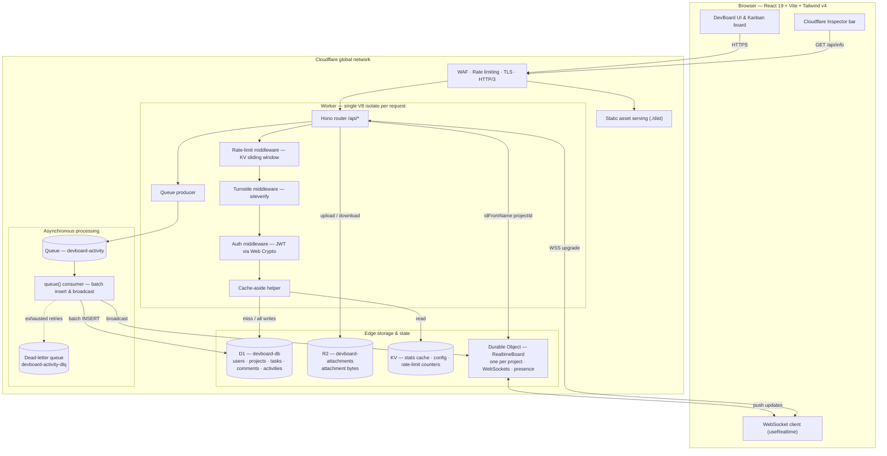
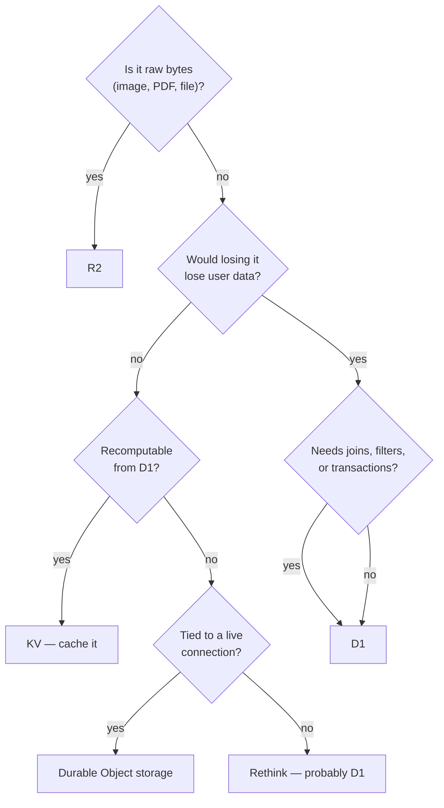
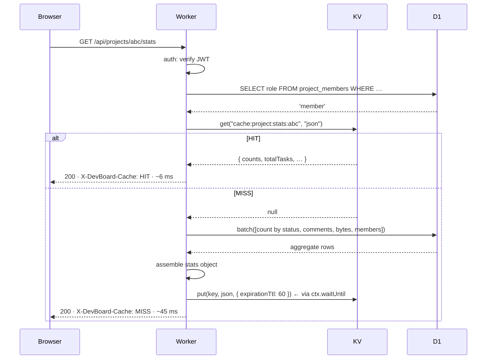
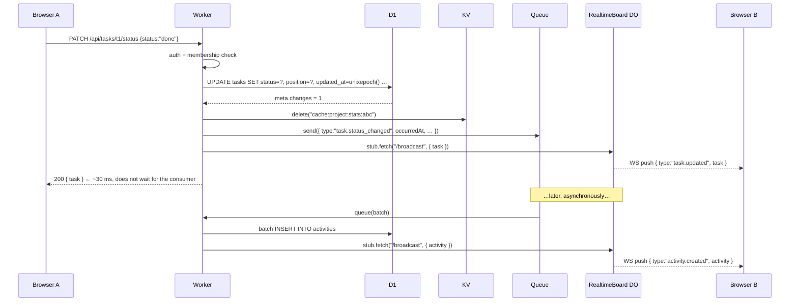
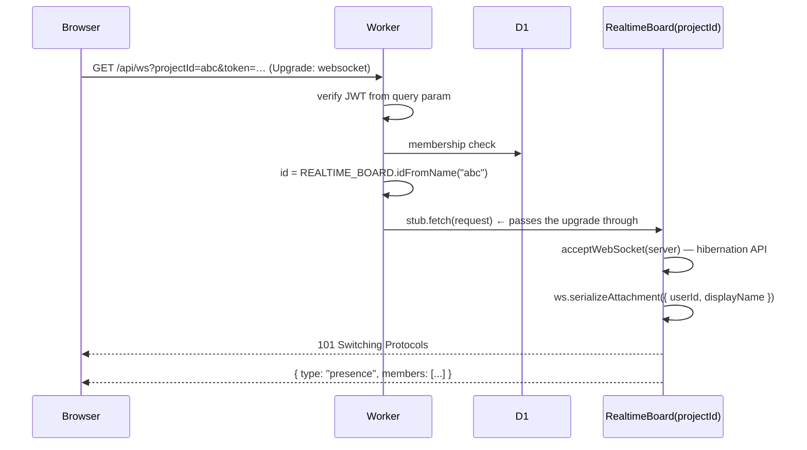

# Architecture

> How DevBoard is put together: the edge request path, the nine Cloudflare primitives and what each one is actually for, the Worker's internal structure, and the full API surface.
>
> Start at [AGENT.md](../AGENT.md) · Related: [database.md](./database.md) · [security.md](./security.md) · [deployment.md](./deployment.md)

**Status:** Specification. The repo currently contains only the Vite/React frontend scaffold. `worker/` and `wrangler.jsonc` arrive in **Phase 1**.

---

## 1. The shape of the thing

DevBoard is **one Cloudflare Worker**. Not a Worker plus a server, not a frontend host plus an API host — one deployable unit that serves the React bundle *and* the REST API *and* the WebSocket upgrade, from every Cloudflare edge location.



The unusual property, and the one worth sitting with: **there is no origin server.** Nothing in that diagram runs in a datacenter you chose. The code executes wherever the request lands, and the data lives in primitives designed to be reachable from anywhere that code might run.

---

## 2. The nine primitives and what each one is for

| Service | Role in DevBoard | The problem it solves | How the Worker talks to it |
| :--- | :--- | :--- | :--- |
| **Workers** | The whole application — API, WebSocket gateway, static asset host | Replaces a long-lived server process with V8 isolates that cold-start in ~5 ms and run in 300+ locations | `export default { fetch(req, env, ctx), queue(batch, env, ctx) }` |
| **D1** | Primary database | Real relational SQL with foreign keys, transactions, and migrations — at the edge, with no connection pool to manage | `env.DB.prepare().bind().first()/.all()/.run()`, `env.DB.batch([...])` |
| **R2** | Attachment bytes | Blob storage with **zero egress fees**, S3-compatible, kept out of the relational database | `env.BUCKET.put(key, stream, opts)`, `.get(key)`, `.delete(keys)`, `.list({prefix})` |
| **KV** | Derived caches, feature flags, rate-limit counters | Sub-10 ms reads from a local edge cache for data that is read constantly and changes rarely | `env.KV.get(key, "json")`, `env.KV.put(key, val, { expirationTtl })`, `.delete(key)` |
| **Durable Objects** | `RealtimeBoard` — live collaboration | Workers are stateless and everywhere; a WebSocket needs *one* place. A DO is a single-threaded actor with a globally unique address | `env.REALTIME_BOARD.idFromName(projectId)` → `.get(id)` → `stub.fetch(req)` |
| **Queues** | Activity feed ingestion | Decouples the user-facing response from write amplification. No RabbitMQ, no Kafka, no consumer fleet to run | Producer `env.ACTIVITY_QUEUE.send(msg)`; consumer `queue(batch, env, ctx)` |
| **Turnstile** | Bot protection on auth forms | Stops scripted registration and credential stuffing without making humans identify traffic lights | Widget yields a token → Worker POSTs it to `challenges.cloudflare.com/turnstile/v0/siteverify` |
| **WAF / Rate Limiting** | Edge abuse protection | Filters attacks before they consume a single millisecond of your compute budget | Dashboard rules, plus a KV sliding-window limiter in Worker middleware |
| **DNS / CDN / SSL** | Delivery | Automatic TLS, HTTP/3, global anycast routing, asset caching — all zero-config | Dashboard + `assets` binding in `wrangler.jsonc` |

### The decision table: which store for which data?

This is the question you will actually face while implementing. Answer it in this order:



Full comparison in [database.md §1](./database.md#1-four-stores-four-jobs).

---

## 3. Why Hono

The Worker runtime hands you a bare `fetch(request, env, ctx)`. That is enough to build everything, and painful past about five routes. DevBoard uses [Hono](https://hono.dev) — added in **Phase 1** — for three specific reasons:

1. **It is Web Standards, not an abstraction.** Hono's `Request` and `Response` *are* the platform's. There is no adapter layer translating a Node `req`/`res` shape, which means no impedance mismatch and no surprises about streaming or WebSocket upgrade.
2. **It does not hide the bindings.** `c.env.DB`, `c.env.BUCKET`, `c.env.KV`, `c.env.REALTIME_BOARD`, `c.env.ACTIVITY_QUEUE` are right there in the handler. This matters enormously for a project whose purpose is learning Cloudflare — a repository pattern wrapping `env.DB` would teach you the repository pattern instead.
3. **Zero dependencies, ~14 KB.** Bundle size is startup latency in a Worker.

What Hono is used for: routing, path/query param parsing, middleware composition, `c.json()` helpers, and typed `Variables` for values that middleware attaches to the context (the authenticated user, the cache verdict). What it is *not* used for: data access, validation logic, or anything that would obscure a Cloudflare API call.

```ts
// worker/index.ts — the shape, Phase 1
import { Hono } from "hono";
import type { Env, Variables } from "./env";

const app = new Hono<{ Bindings: Env; Variables: Variables }>();

app.use("*", corsMiddleware);
app.use("*", timingMiddleware);
app.onError(errorHandler);

app.route("/api/auth", authRoutes);
app.route("/api/projects", projectRoutes);
// …

export default {
  fetch: app.fetch,
  queue: handleActivityBatch,
} satisfies ExportedHandler<Env, ActivityMessage>;

export { RealtimeBoard } from "./durable-objects/RealtimeBoard";
```

Note the last line: **the Durable Object class must be exported from the Worker's entrypoint module.** That is how the runtime finds the class named in `wrangler.jsonc`.

---

## 4. V8 isolates vs. containers — why this is different

The mental model you bring from Node/Express is the main source of bugs in a Workers project, so it is worth being precise.

| | **Traditional Node server** | **Cloudflare Worker** |
| :--- | :--- | :--- |
| Unit of isolation | OS process / container | V8 isolate |
| Cold start | 100 ms – several seconds | ~5 ms, effectively free |
| Memory | Hundreds of MB, yours to keep | 128 MB, shared, transient |
| Lifetime | Hours to weeks | One request, typically. May be reused, may not |
| Module-scope state | A reliable cache | **A coincidence.** Never rely on it |
| Filesystem | Available | None |
| Node built-ins | All of them | Only with `nodejs_compat`, and only some |
| CPU time | Whatever you use | ~30 s wall clock limit; CPU-bound work is metered |
| Concurrency model | Threads / event loop, one machine | Thousands of isolates across 300+ locations |

The three practical consequences:

**Module scope is not a cache.** A `const cache = new Map()` at module level will appear to work in local dev and give you a ~0% hit rate in production, because the next request lands in a different isolate in a different city. Caching goes in KV. State that must be single-instance goes in a Durable Object.

**No Node built-ins by default.** No `crypto` module (use `crypto.subtle`), no `fs`, no `Buffer` (use `Uint8Array` and `TextEncoder`), no `path`. This is why authentication is written against Web Crypto by hand in [security.md](./security.md) rather than pulling in `bcrypt`.

**Work after the response.** Anything you want to do without making the user wait goes in `ctx.waitUntil(promise)` — the runtime keeps the isolate alive until it settles. Cache writes and non-critical logging belong there. Queue sends generally do *not*: if the send fails you usually want to know, and it is a single fast call.

---

## 5. Worker structure

Target layout, built up across Phases 1–7:

```
worker/
├── index.ts                     # fetch() + queue() exports, DO re-export, middleware wiring
├── env.ts                       # Env bindings + Hono Variables types
├── durable-objects/
│   └── RealtimeBoard.ts         # Phase 5 — WebSockets, hibernation, presence, broadcast
├── queue/
│   └── consumer.ts              # Phase 6 — batch handler
├── middleware/
│   ├── auth.ts                  # Phase 2 — JWT verify, attaches user to context
│   ├── rate-limit.ts            # Phase 7 — KV sliding window
│   └── turnstile.ts             # Phase 7 — siteverify
├── routes/
│   ├── auth.ts                  # Phase 2
│   ├── projects.ts              # Phase 2 (+ KV stats in Phase 4)
│   ├── tasks.ts                 # Phase 2
│   ├── attachments.ts           # Phase 3
│   ├── activities.ts            # Phase 6
│   └── ws.ts                    # Phase 5 — upgrade & forward to DO
├── lib/
│   ├── jwt.ts                   # Phase 2 — HS256 sign/verify via Web Crypto
│   ├── password.ts              # Phase 2 — PBKDF2 hash/verify
│   ├── cache-keys.ts            # Phase 4 — the only place KV keys are constructed
│   ├── cache.ts                 # Phase 4 — cache-aside helper
│   └── errors.ts                # Phase 1 — ApiError + JSON envelope
└── db/
    ├── schema.sql
    └── migrations/
```

### The bindings type

`worker/env.ts` is hand-written and mirrors `wrangler.jsonc`. `wrangler types` generates `worker-configuration.d.ts` with the runtime's ambient types — that file is **generated, never edited**.

```ts
export interface Env {
  // Storage
  DB: D1Database;
  BUCKET: R2Bucket;
  KV: KVNamespace;

  // Stateful compute
  REALTIME_BOARD: DurableObjectNamespace<RealtimeBoard>;

  // Async
  ACTIVITY_QUEUE: Queue<ActivityMessage>;

  // Static assets (Phase 8)
  ASSETS: Fetcher;

  // Secrets — wrangler secret put, never in wrangler.jsonc
  JWT_SECRET: string;
  TURNSTILE_SECRET_KEY: string;

  // Plain vars
  ENVIRONMENT: "development" | "staging" | "production";
}

// Values middleware attaches to the Hono context.
export interface Variables {
  user: AuthUser;          // set by auth middleware; absent on public routes
  requestStart: number;    // set by timing middleware
  cacheStatus: "HIT" | "MISS" | "BYPASS";
}
```

### Middleware order

Order is a security property, not a style choice. Cheap rejections come first so an attacker cannot make you do expensive work.

```
1. CORS + security headers   — every request
2. Timing                    — starts the clock for X-DevBoard-Duration
3. Rate limit                — auth routes and mutations; KV read, ~2 ms
4. Turnstile                 — register/login only; one subrequest
5. Auth (JWT verify)         — protected routes; pure crypto, no I/O
6. Authorization             — per-route project membership check; one D1 read
7. Handler
```

Never authenticate before rate limiting: an unauthenticated flood would otherwise force a JWT verification per request. Never authorize before authenticating, for obvious reasons.

---

## 6. Request lifecycle walkthroughs

Four paths that between them touch every primitive.

### 6.1 `GET /api/projects/:id/stats` — cache-aside, both branches



The cache write goes through `ctx.waitUntil()` so the user is not made to wait for a write whose only benefit accrues to the *next* request.

```ts
// worker/lib/cache.ts — Phase 4
export async function cacheAside<T>(
  c: Context<{ Bindings: Env; Variables: Variables }>,
  key: string,
  ttlSeconds: number,
  compute: () => Promise<T>,
): Promise<T> {
  const cached = await c.env.KV.get<T>(key, "json");
  if (cached !== null) {
    c.set("cacheStatus", "HIT");
    return cached;
  }

  c.set("cacheStatus", "MISS");
  const fresh = await compute();
  c.executionCtx.waitUntil(
    c.env.KV.put(key, JSON.stringify(fresh), { expirationTtl: ttlSeconds }),
  );
  return fresh;
}
```

### 6.2 `PATCH /api/tasks/:id/status` — the full fan-out

The most instructive path in the application: one user action, four primitives, and a response that does not wait for three of them.



Ordering rules that matter:

- **D1 first.** Nothing else happens unless the durable write succeeded. If `meta.changes === 0`, return 404 and touch nothing else.
- **Invalidate the cache before responding**, not in `waitUntil`. If the user immediately re-reads stats, a stale HIT is a visible bug. Correctness beats 3 ms.
- **Broadcast the new value, not a "go re-fetch" signal.** Telling clients to re-read would multiply one write into N reads and re-expose D1 replication lag. Push the state.
- **The queue send is fire-and-forget from the user's perspective** but awaited by the handler, because a failed send should be a logged error, not a silent hole in the activity feed.

### 6.3 `POST /api/tasks/:id/attachments` — streaming to R2

```mermaid
sequenceDiagram
    participant C as Browser
    participant W as Worker
    participant R as R2
    participant D as D1
    participant Q as Queue

    C->>W: POST multipart/form-data (file)
    W->>W: auth + membership; validate size & MIME
    W->>W: fileKey = attachments/{proj}/{task}/{uuid}{ext}
    W->>R: put(fileKey, stream, { httpMetadata })
    R-->>W: ok
    W->>D: INSERT INTO attachments (…)
    D-->>W: ok
    W->>Q: send({ type:"attachment.uploaded", … })
    W-->>C: 201 { attachment }
```

**R2 before D1, deliberately.** If the D1 insert fails you leak an unreferenced object — invisible, cheap, reclaimable by a prefix sweep. The reverse order would leave a metadata row pointing at nothing, which is a broken download link in the UI. Prefer garbage over lies.

The body is **streamed**, never buffered: `request.body` is a `ReadableStream` and R2 accepts it directly. Reading it into memory first would put a hard ceiling at the Worker's 128 MB and burn CPU time for no reason.

Download (`GET /api/attachments/:id/download`) reverses it: D1 lookup for authorization and the key, `env.BUCKET.get(key)`, then return `new Response(object.body, { headers })` with `Content-Type` and `Content-Disposition` from the stored `httpMetadata`. See [security.md](./security.md) for why `Content-Disposition: attachment` is not optional.

### 6.4 `GET /api/ws?projectId=…` — upgrade and hand off



Three things worth understanding:

**`idFromName(projectId)` is the whole trick.** The same string always resolves to the same Durable Object, from any Worker in any location. That is how thousands of stateless isolates agree on one place to put a project's sockets — no service discovery, no sticky sessions, no Redis.

**The token travels in the query string**, because browsers do not let you set headers on a `WebSocket` constructor. This makes it appear in logs, so the WS token is short-lived (5 minutes) and separately issued by `POST /api/auth/ws-token` rather than being the session JWT. Detail in [security.md](./security.md).

**Authorization happens in the Worker, before the DO ever sees the request.** The DO trusts what it is handed. Never make the DO re-derive permissions — it has no cheap path to D1 and doing so serializes every connection behind a database call.

### The DO, in outline

```ts
export class RealtimeBoard extends DurableObject<Env> {
  async fetch(request: Request): Promise<Response> {
    const url = new URL(request.url);

    if (url.pathname === "/broadcast") {
      const payload = await request.json();
      this.broadcast(payload);
      return new Response(null, { status: 204 });
    }

    const pair = new WebSocketPair();
    const [client, server] = Object.values(pair);

    // Hibernation: the runtime, not our code, holds the socket.
    this.ctx.acceptWebSocket(server);
    server.serializeAttachment({
      userId: url.searchParams.get("userId"),
      displayName: url.searchParams.get("displayName"),
      joinedAt: Date.now(),
    });

    this.broadcastPresence();
    return new Response(null, { status: 101, webSocket: client });
  }

  // Called by the runtime on wake — instance fields are gone, roster is rebuilt.
  async webSocketMessage(ws: WebSocket, message: string) { /* … */ }
  async webSocketClose(ws: WebSocket) { this.broadcastPresence(); }

  private broadcast(payload: unknown, except?: WebSocket) {
    const data = JSON.stringify(payload);
    for (const ws of this.ctx.getWebSockets()) {
      if (ws !== except) ws.send(data);
    }
  }
}
```

**Hibernation is the reason this scales.** Without it, an idle project with 3 connected users would keep a DO in memory indefinitely and bill you for it. `acceptWebSocket()` hands the socket to the runtime, which evicts your isolate while keeping connections open, and reconstructs it when a message arrives. The cost: your instance fields do not survive. Everything you need on wake comes from `ctx.getWebSockets()` and each socket's `deserializeAttachment()`.

---

## 7. API surface

Base path `/api`. All responses JSON except `/api/attachments/:id/download`. `Auth` = requires `Authorization: Bearer <jwt>`.

| Method | Path | Auth | Bindings touched | Phase |
| :--- | :--- | :---: | :--- | :---: |
| GET | `/api/health` | – | – | 1 |
| GET | `/api/info` | – | – | 1 |
| GET | `/api/config` | – | KV | 4 |
| POST | `/api/auth/register` | – | D1, KV¹, Turnstile | 2 / 7 |
| POST | `/api/auth/login` | – | D1, KV¹, Turnstile | 2 / 7 |
| GET | `/api/auth/me` | ✓ | D1 | 2 |
| POST | `/api/auth/ws-token` | ✓ | – | 5 |
| GET | `/api/projects` | ✓ | D1, KV | 2 / 4 |
| POST | `/api/projects` | ✓ | D1, KV | 2 |
| GET | `/api/projects/:id` | ✓ | D1 | 2 |
| PATCH | `/api/projects/:id` | ✓ | D1, KV | 2 |
| DELETE | `/api/projects/:id` | ✓ | D1, R2, KV | 2 / 3 |
| GET | `/api/projects/:id/stats` | ✓ | KV, D1 | 4 |
| POST | `/api/projects/:id/cache/purge` | ✓ | KV | 4 |
| GET | `/api/projects/:id/tasks` | ✓ | D1 | 2 |
| POST | `/api/projects/:id/tasks` | ✓ | D1, KV, Queue, DO | 2 / 6 |
| GET | `/api/projects/:id/activities` | ✓ | D1 | 6 |
| GET | `/api/tasks/:id` | ✓ | D1 | 2 |
| PATCH | `/api/tasks/:id` | ✓ | D1, KV, Queue, DO | 2 / 6 |
| PATCH | `/api/tasks/:id/status` | ✓ | D1, KV, Queue, DO | 2 / 6 |
| DELETE | `/api/tasks/:id` | ✓ | D1, R2, KV, Queue, DO | 2 / 3 |
| GET | `/api/tasks/:id/comments` | ✓ | D1 | 2 |
| POST | `/api/tasks/:id/comments` | ✓ | D1, KV, Queue, DO | 2 / 6 |
| DELETE | `/api/comments/:id` | ✓ | D1, Queue | 2 |
| GET | `/api/tasks/:id/attachments` | ✓ | D1 | 3 |
| POST | `/api/tasks/:id/attachments` | ✓ | R2, D1, Queue | 3 |
| GET | `/api/attachments/:id/download` | ✓ | D1, R2 | 3 |
| DELETE | `/api/attachments/:id` | ✓ | D1, R2, Queue | 3 |
| GET | `/api/ws?projectId=&token=` | ✓² | DO | 5 |

¹ KV here is the rate-limit counter, not a cache.
² Short-lived WS token in the query string, not the session JWT.

### Response envelope

Success returns the resource directly — no `{ data: … }` wrapper. Errors always take one shape:

```jsonc
// 422
{
  "error": {
    "code": "VALIDATION_FAILED",
    "message": "Title is required",
    "details": { "field": "title" }   // optional
  }
}
```

```ts
// worker/lib/errors.ts — Phase 1
export class ApiError extends Error {
  constructor(
    public status: ContentfulStatusCode,
    public code: string,
    message: string,
    public details?: Record<string, unknown>,
  ) { super(message); }
}

app.onError((err, c) => {
  if (err instanceof ApiError) {
    return c.json({ error: { code: err.code, message: err.message, details: err.details } }, err.status);
  }
  console.error("unhandled", err);           // shows up in wrangler tail / Workers Logs
  return c.json(
    { error: { code: "INTERNAL", message: "Something went wrong" } },
    500,
  );
});
```

Never leak an exception message to the client. `console.error` is the right channel — Workers Logs captures it, and `wrangler tail` streams it live.

| Status | When |
| :--- | :--- |
| 400 | Malformed request — bad JSON, missing param |
| 401 | Missing or invalid JWT |
| 403 | Valid identity, insufficient project role |
| 404 | Not found **or** not visible to this user (do not distinguish — that is an enumeration oracle) |
| 409 | Conflict — duplicate email, duplicate project slug |
| 413 | Upload exceeds the size limit |
| 415 | Disallowed MIME type |
| 422 | Validation failed |
| 429 | Rate limited — always with `Retry-After` |
| 500 | Unhandled |

### Response headers

Custom headers exist so the Cloudflare Inspector bar can render what actually happened. Added by middleware on every `/api` response.

| Header | Example | Source |
| :--- | :--- | :--- |
| `X-DevBoard-Colo` | `BOM` | `request.cf?.colo` |
| `X-DevBoard-Duration` | `43` (ms) | Timing middleware |
| `X-DevBoard-Cache` | `HIT` / `MISS` / `BYPASS` | Cache-aside helper via `c.get("cacheStatus")` |
| `X-DevBoard-D1-Duration` | `12` | Sum of `meta.duration` |
| `X-DevBoard-D1-Rows-Read` | `56` | Sum of `meta.rows_read` |
| `X-DevBoard-Services` | `d1,kv,queue` | Which bindings the handler touched |

These must be in `Access-Control-Expose-Headers`, or the browser will hide them from `fetch()` even though they arrive on the wire. This is a very easy hour to lose.

`request.cf` is `undefined` in local `wrangler dev` — the Inspector bar shows `LOCAL` rather than a colo code. Do not treat its absence as an error.

---

## 8. Frontend architecture

```
src/
├── api/client.ts          # typed fetch wrapper: base URL, bearer token, ApiError parsing,
│                          # reads X-DevBoard-* headers into the inspector store
├── hooks/
│   ├── useAuth.ts         # Phase 2 — context provider, token persistence, me()
│   ├── useProjects.ts     # Phase 2 — projects & tasks, optimistic mutations
│   └── useRealtime.ts     # Phase 5 — WebSocket, exponential backoff, event → state
├── components/
│   ├── layout/            # Navbar, CloudflareBar
│   ├── kanban/            # Board, TaskCard, TaskModal
│   ├── activity/          # ActivityFeed
│   ├── auth/              # LoginForm, RegisterForm (Turnstile)
│   └── ui/                # shadcn primitives — Button exists today
├── App.tsx
└── index.css              # Tailwind v4 + design tokens
```

**No data-fetching library.** React 19 plus a small typed client is enough for this surface area, and adding TanStack Query would hide the request lifecycle that the Inspector bar exists to reveal. State lives in context providers per domain.

**Realtime and optimistic updates are separate systems that must agree.** The rule: a mutating client applies its change optimistically and ignores the echo of its own broadcast (matched by a client-generated `mutationId` round-tripped through the DO). Non-mutating clients apply the broadcast directly. Reconciliation policy is last-write-wins on `updated_at`, with a toast when an incoming change overwrites a local edit — see [DESIGN.md](../DESIGN.md).

**Local dev topology** (Phase 1): Vite on `5173` proxies `/api` and `/ws` to `wrangler dev` on `8787`. That proxy block does not exist in `vite.config.ts` yet; it is specified in [deployment.md](./deployment.md). In production there is no proxy, because one Worker serves both.

---

## 9. Static assets: one Worker, both halves

Phase 8 adds to `wrangler.jsonc`:

```jsonc
"assets": {
  "directory": "./dist",
  "binding": "ASSETS",
  "not_found_handling": "single-page-application"
}
```

Request routing then works like this: Cloudflare checks for a matching static file *first* — served straight from cache, without invoking your Worker at all, so it costs nothing. Only on a miss does the Worker run. `not_found_handling: "single-page-application"` makes unmatched paths return `index.html`, which is what a client-side router needs.

A single `wrangler deploy` therefore ships the React build and the API together, atomically, with no version skew between frontend and backend. That property is worth more than it sounds.

---

## 10. Failure modes and what happens

| Failure | Behaviour | Mitigation |
| :--- | :--- | :--- |
| D1 unavailable | 500 from the affected route | Nothing to do — D1 is the source of truth. Fail loudly |
| KV unavailable | Cache reads return `null` → treated as MISS | Wrap the KV read in try/catch and degrade to `BYPASS`. Never 500 because a *cache* is down |
| R2 unavailable | Upload 500s; download 502s | Metadata intact; retry works |
| DO unreachable | Broadcast fails | Catch and log. The write already succeeded — realtime is an enhancement, never a precondition |
| Queue send fails | Activity is lost | Log it. The user-facing action already committed |
| Queue consumer throws | Batch retried with backoff, then dead-lettered | `max_retries: 3` → `devboard-activity-dlq` |
| WebSocket drops | Client reconnects with exponential backoff, refetches board state on reconnect | `useRealtime` handles it; UI shows a reconnecting state |

The through-line: **degrade the enhancements, never the durable write.** A user whose task saved but whose collaborator did not see it update instantly had a slightly worse experience. A user whose task did not save had a bug.

---

## 11. Performance budget

| Path | Target | Dominated by |
| :--- | ---: | :--- |
| Static asset | < 20 ms | Edge cache; Worker never runs |
| `GET /api/health` | < 10 ms | Isolate start |
| Cached stats (HIT) | < 15 ms | One KV read |
| Uncached stats (MISS) | < 80 ms | One batched D1 round trip |
| Board load | < 120 ms | Two D1 queries |
| Task status update | < 60 ms | D1 write + KV delete |
| Realtime broadcast → paint | < 200 ms | DO hop + WS |
| Queue produce → activity visible | < 5 s | Batching window, by design |

If a number drifts, `X-DevBoard-D1-Rows-Read` is usually the tell — a spike there means a query stopped using its index.
