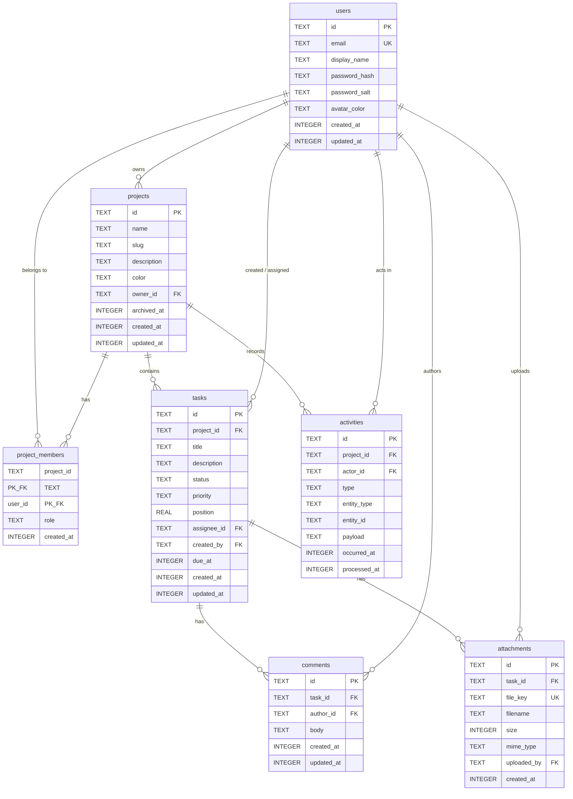

# Database & Data Model

> The single source of truth for DevBoard's data: D1 schema, KV key namespaces, R2 object layout, and Durable Object storage. Every other doc links here rather than restating DDL.
>
> Start at [AGENT.md](../AGENT.md) · Related: [architecture.md](./architecture.md) · [security.md](./security.md)

**Status:** Specification. No migrations exist in the repo yet — `worker/db/` arrives in **Phase 2**.

---

## 1. Four stores, four jobs

DevBoard deliberately uses four different Cloudflare storage primitives instead of forcing everything into one. Knowing *why* each exists is half the point of the project.

| Store | Holds | Consistency | Latency | Source of truth? |
| :--- | :--- | :--- | :--- | :--- |
| **D1** (SQLite) | Users, projects, tasks, comments, attachment *metadata*, activity log | Strong / ACID transactions | ~5–50 ms | **Yes** — always |
| **KV** | Derived read caches, feature flags, rate-limit counters | Eventually consistent (up to ~60 s globally) | ~1–10 ms read | Never |
| **R2** | Attachment *bytes* | Strong read-after-write for a given key | ~20–100 ms | Yes, for blob content only |
| **Durable Object storage** | Live presence, WebSocket session bookkeeping | Strongly consistent, single-actor serialized | Sub-ms (colocated) | Yes, for ephemeral state only |

The rule that follows from this table, and the one rule to internalise:

> **If deleting a store would lose user data, it is D1 or R2. If deleting it would only cost a slow rebuild, it is KV or DO storage.**

You should be able to run `wrangler kv key delete` across the entire namespace and lose nothing but latency. If that is ever untrue, a bug has been introduced.

---

## 2. Entity relationship diagram



---

## 3. Conventions

These apply to every table. Follow them without exception so the schema stays predictable.

| Convention | Choice | Why |
| :--- | :--- | :--- |
| Primary keys | `TEXT` holding a UUID v4 from `crypto.randomUUID()` | No autoincrement round-trip, safe to generate client- or edge-side, no ID enumeration |
| Timestamps | `INTEGER` Unix **seconds**, default `(unixepoch())` | SQLite has no native date type; integers sort, index, and diff cleanly. Format for display on the client, never in SQL |
| Booleans | `INTEGER` `0`/`1` with a `CHECK` | SQLite has no boolean type |
| Enums | `TEXT` with a `CHECK (col IN (...))` constraint | Readable in `wrangler d1 execute` output; the constraint is the validation |
| Soft delete | `archived_at INTEGER NULL` (projects only) | Everything else hard-deletes via `ON DELETE CASCADE` |
| Naming | `snake_case` tables and columns, plural table names | Matches SQLite convention; the API layer maps to `camelCase` |
| JSON | `TEXT` column holding serialized JSON (`activities.payload`) | D1 supports SQLite's `json_*()` functions if you need to query into it |

**Column-name mapping.** D1 returns `snake_case`; the API returns `camelCase`. Do the mapping explicitly in each route's response builder — do not ship raw D1 rows to the client, because that leaks column names and makes future schema changes breaking changes.

---

## 4. Migrations

### Layout

```
worker/db/
├── schema.sql                    # Full current schema, regenerated for reference. NOT executed.
└── migrations/
    ├── 0001_initial.sql          # Phase 2 — users, projects, project_members, tasks, comments
    ├── 0002_attachments.sql      # Phase 3 — attachments
    └── 0003_activities.sql       # Phase 6 — activities
```

> **Note on numbering.** The original implementation plan is inconsistent here — Phase 3 calls the second migration `0002_attachments.sql` while the directory tree labels it `0002_activities.sql`. This doc resolves it as **one migration per phase that changes the schema**: `0002` adds attachments (Phase 3), `0003` adds activities (Phase 6). `schema.sql` is a human-readable snapshot only; Wrangler never runs it.

### Rules

1. **Migrations are append-only.** Once a numbered file has been applied to *any* remote database, it is frozen. Fix mistakes with a new migration, never by editing an applied one.
2. Filenames are `NNNN_snake_case_description.sql`, zero-padded to four digits. Wrangler orders by this prefix.
3. Each migration is idempotent-safe where cheap (`CREATE TABLE IF NOT EXISTS`), but do not rely on it — Wrangler tracks applied migrations in a `d1_migrations` table it manages for you.
4. Every migration that adds a table also adds its indexes in the same file.
5. Test locally before remote, always.

### Commands

```bash
# Create the migration file (Wrangler picks the next number)
npx wrangler d1 migrations create devboard-db initial

# See what has not been applied yet
npx wrangler d1 migrations list devboard-db --local
npx wrangler d1 migrations list devboard-db --remote

# Apply — local Miniflare SQLite first, then production
npx wrangler d1 migrations apply devboard-db --local
npx wrangler d1 migrations apply devboard-db --remote

# Ad-hoc inspection
npx wrangler d1 execute devboard-db --local --command "SELECT * FROM tasks LIMIT 5"
npx wrangler d1 execute devboard-db --local --file ./worker/db/seed.sql
```

Local D1 state lives under `.wrangler/state/` and is gitignored. Deleting that directory is the reset button — re-apply migrations afterwards.

---

## 5. `0001_initial.sql` — Phase 2

```sql
-- DevBoard 0001_initial
-- Users, projects, membership, tasks, comments.
-- All timestamps are Unix seconds (INTEGER). All ids are UUID v4 (TEXT).

PRAGMA foreign_keys = ON;

-- ---------------------------------------------------------------- users
CREATE TABLE users (
  id            TEXT    PRIMARY KEY,
  email         TEXT    NOT NULL UNIQUE,
  display_name  TEXT    NOT NULL,
  password_hash TEXT    NOT NULL,          -- base64 PBKDF2-SHA256 derived key
  password_salt TEXT    NOT NULL,          -- base64, 16 random bytes, per user
  avatar_color  TEXT    NOT NULL DEFAULT 'neutral',
  created_at    INTEGER NOT NULL DEFAULT (unixepoch()),
  updated_at    INTEGER NOT NULL DEFAULT (unixepoch())
);

-- ------------------------------------------------------------- projects
CREATE TABLE projects (
  id          TEXT    PRIMARY KEY,
  name        TEXT    NOT NULL,
  slug        TEXT    NOT NULL,
  description TEXT,
  color       TEXT    NOT NULL DEFAULT 'neutral',
  owner_id    TEXT    NOT NULL REFERENCES users(id) ON DELETE CASCADE,
  archived_at INTEGER,
  created_at  INTEGER NOT NULL DEFAULT (unixepoch()),
  updated_at  INTEGER NOT NULL DEFAULT (unixepoch())
);

CREATE INDEX        idx_projects_owner      ON projects(owner_id);
CREATE UNIQUE INDEX idx_projects_owner_slug ON projects(owner_id, slug);

-- ------------------------------------------------------- project_members
CREATE TABLE project_members (
  project_id TEXT    NOT NULL REFERENCES projects(id) ON DELETE CASCADE,
  user_id    TEXT    NOT NULL REFERENCES users(id)    ON DELETE CASCADE,
  role       TEXT    NOT NULL DEFAULT 'member'
                     CHECK (role IN ('owner', 'admin', 'member', 'viewer')),
  created_at INTEGER NOT NULL DEFAULT (unixepoch()),
  PRIMARY KEY (project_id, user_id)
);

CREATE INDEX idx_project_members_user ON project_members(user_id);

-- ---------------------------------------------------------------- tasks
CREATE TABLE tasks (
  id          TEXT    PRIMARY KEY,
  project_id  TEXT    NOT NULL REFERENCES projects(id) ON DELETE CASCADE,
  title       TEXT    NOT NULL,
  description TEXT,
  status      TEXT    NOT NULL DEFAULT 'todo'
                      CHECK (status IN ('todo', 'in_progress', 'done')),
  priority    TEXT    NOT NULL DEFAULT 'medium'
                      CHECK (priority IN ('low', 'medium', 'high', 'urgent')),
  position    REAL    NOT NULL DEFAULT 1000,
  assignee_id TEXT    REFERENCES users(id) ON DELETE SET NULL,
  created_by  TEXT    NOT NULL REFERENCES users(id) ON DELETE CASCADE,
  due_at      INTEGER,
  created_at  INTEGER NOT NULL DEFAULT (unixepoch()),
  updated_at  INTEGER NOT NULL DEFAULT (unixepoch())
);

-- Covers the hot query: one board's column, in order.
CREATE INDEX idx_tasks_project_status ON tasks(project_id, status, position);
CREATE INDEX idx_tasks_assignee       ON tasks(assignee_id);

-- ------------------------------------------------------------- comments
CREATE TABLE comments (
  id         TEXT    PRIMARY KEY,
  task_id    TEXT    NOT NULL REFERENCES tasks(id) ON DELETE CASCADE,
  author_id  TEXT    NOT NULL REFERENCES users(id) ON DELETE CASCADE,
  body       TEXT    NOT NULL,
  created_at INTEGER NOT NULL DEFAULT (unixepoch()),
  updated_at INTEGER NOT NULL DEFAULT (unixepoch())
);

CREATE INDEX idx_comments_task ON comments(task_id, created_at);
```

### Design notes on `0001`

**`position REAL`, not `INTEGER`.** Kanban reordering is the classic case for fractional indexing. To drop a card between two neighbours you set `position = (prev.position + next.position) / 2` and write **one** row, instead of renumbering every card in the column. Cards are created at `max(position) + 1000` to leave gaps. `REAL` gives ~52 bits of mantissa, so you can bisect roughly 50 times between two adjacent values before precision runs out — far beyond realistic use. If you ever hit it, a background renormalisation pass rewrites the column as `1000, 2000, 3000, …`.

**`email` is `UNIQUE` on the raw column.** The Worker lowercases and trims email before every insert and lookup, so `Alice@Example.com` and `alice@example.com` collide as intended. This is an application-layer invariant — write it once in a helper and use it everywhere. (An expression index on `lower(email)` would enforce it in the database, at the cost of a less obvious schema; the app-layer rule is the deliberate simplification here.)

**Why `project_members` exists even though `projects.owner_id` does.** `owner_id` answers "who created this"; `project_members` answers "who may act on this, and at what level". Authorization checks read `project_members` only. The owner is inserted as a `role = 'owner'` member row in the same batch that creates the project — see [security.md](./security.md#6-authorization).

**`ON DELETE SET NULL` for `assignee_id`, `CASCADE` for `created_by`.** Deleting a user should orphan their assignments (the task survives, unassigned) but tasks they authored are theirs — this is a small-team app, and the cascade keeps the model simple. If DevBoard ever grew real tenancy, `created_by` would become `ON DELETE SET NULL` plus a "deleted user" tombstone.

---

## 6. `0002_attachments.sql` — Phase 3

```sql
-- DevBoard 0002_attachments
-- Metadata rows for objects stored in R2. Bytes never live in D1.

CREATE TABLE attachments (
  id          TEXT    PRIMARY KEY,
  task_id     TEXT    NOT NULL REFERENCES tasks(id) ON DELETE CASCADE,
  file_key    TEXT    NOT NULL UNIQUE,     -- the R2 object key
  filename    TEXT    NOT NULL,            -- original, user-supplied, display only
  size        INTEGER NOT NULL,            -- bytes
  mime_type   TEXT    NOT NULL,
  uploaded_by TEXT    NOT NULL REFERENCES users(id) ON DELETE CASCADE,
  created_at  INTEGER NOT NULL DEFAULT (unixepoch())
);

CREATE INDEX idx_attachments_task ON attachments(task_id, created_at);
```

**`file_key` is `UNIQUE` and server-generated.** It is never derived from `filename` in a way the user controls — see [R2 object layout](#8-r2-object-layout) and the upload-security section of [security.md](./security.md).

**The cascade is a lie you must handle.** `ON DELETE CASCADE` removes the *metadata row* when a task is deleted. It does **not** remove the object from R2 — D1 knows nothing about R2. Deleting a task must therefore:

1. `SELECT file_key FROM attachments WHERE task_id = ?`
2. `env.BUCKET.delete(keys)` (R2 accepts an array, up to 1000 keys)
3. Delete the task row, letting the cascade clean up metadata

If step 2 fails you get an orphaned object — wasted storage, no correctness problem, and R2 has no egress cost for the leak. Do steps in this order (R2 first, D1 last) so a failure leaves a *dangling object* rather than a *dangling metadata row pointing at nothing*. Broken download links are worse than invisible garbage.

---

## 7. `0003_activities.sql` — Phase 6

```sql
-- DevBoard 0003_activities
-- Append-only activity log, written exclusively by the Queue consumer.

CREATE TABLE activities (
  id           TEXT    PRIMARY KEY,
  project_id   TEXT    NOT NULL REFERENCES projects(id) ON DELETE CASCADE,
  actor_id     TEXT    REFERENCES users(id) ON DELETE SET NULL,
  type         TEXT    NOT NULL,           -- 'task.created', 'task.status_changed', ...
  entity_type  TEXT    NOT NULL
                       CHECK (entity_type IN ('project', 'task', 'comment', 'attachment')),
  entity_id    TEXT,
  payload      TEXT    NOT NULL DEFAULT '{}',   -- JSON: { from, to, title, ... }
  occurred_at  INTEGER NOT NULL,           -- when the API request happened
  processed_at INTEGER NOT NULL DEFAULT (unixepoch())  -- when the consumer wrote it
);

CREATE INDEX idx_activities_project ON activities(project_id, occurred_at DESC);
```

**Two timestamps, on purpose.** `occurred_at` is stamped by the *producer* (the API request handler) and travels in the queue message. `processed_at` is stamped by the *consumer*. Their difference is end-to-end queue latency — that is exactly the number the Activity Feed's latency chip renders, and it makes the asynchrony of Queues visible instead of theoretical. Typical values are 100 ms–5 s depending on batching settings.

**`actor_id` is nullable** (`ON DELETE SET NULL`) because the log outlives accounts. A deleted user's actions render as "a removed member".

**Activity type vocabulary.** Keep this list closed; the frontend switches on it to pick an icon and phrasing.

| `type` | `entity_type` | `payload` keys |
| :--- | :--- | :--- |
| `task.created` | `task` | `title`, `status` |
| `task.updated` | `task` | `title`, `changed` (array of field names) |
| `task.status_changed` | `task` | `title`, `from`, `to` |
| `task.deleted` | `task` | `title` |
| `comment.created` | `comment` | `taskId`, `taskTitle`, `excerpt` |
| `attachment.uploaded` | `attachment` | `taskId`, `filename`, `size` |
| `attachment.deleted` | `attachment` | `taskId`, `filename` |
| `project.member_added` | `project` | `userId`, `displayName`, `role` |

---

## 8. R2 object layout

Bucket: **`devboard-attachments`** (binding `BUCKET`).

```
attachments/{projectId}/{taskId}/{uuid}{ext}
```

Example: `attachments/9c1f…/4be2…/a7d3f0e1-….png`

| Decision | Rationale |
| :--- | :--- |
| Key is fully server-generated from `crypto.randomUUID()` | User input never reaches the key. No path traversal (`../`), no collisions, no unicode normalisation surprises |
| Original name lives in `attachments.filename`, not the key | Display name and storage identity are separate concerns. Renaming a file is a D1 `UPDATE`, not an R2 copy |
| Extension preserved from a validated allow-list | Lets `Content-Type` sniffing tools and CDN caching behave sensibly |
| `projectId` and `taskId` as prefixes | R2 list operations are prefix-based, so `list({ prefix: "attachments/{projectId}/" })` gives you per-project cleanup and usage totals for free |

Write path uses `httpMetadata` so R2 remembers how to serve the object:

```ts
await env.BUCKET.put(fileKey, request.body, {
  httpMetadata: {
    contentType: mimeType,
    contentDisposition: `attachment; filename="${sanitized}"`,
  },
  customMetadata: { taskId, uploadedBy: user.id },
});
```

`customMetadata` is a convenience for debugging and orphan reconciliation — never read it for authorization. D1 is the authority on who may download what.

---

## 9. KV key namespaces

Namespace binding: **`KV`**. Every key belongs to exactly one of three prefixes. Adding a fourth prefix requires updating this table first.

| Key pattern | Value | TTL | Written by | Invalidated by |
| :--- | :--- | ---: | :--- | :--- |
| `cache:project:stats:<projectId>` | JSON stats blob | 60 s | `GET /api/projects/:id/stats` on miss | Any task/comment/attachment mutation in that project; `POST /api/projects/:id/cache/purge` |
| `cache:user:projects:<userId>` | JSON project list | 30 s | `GET /api/projects` on miss | Project create / update / delete / membership change |
| `config:announcements` | JSON array of banners | none | Operator, via `wrangler kv key put` | Manual |
| `config:maintenance_mode` | `"on"` \| `"off"` | none | Operator | Manual |
| `config:feature_flags` | JSON object | none | Operator | Manual |
| `ratelimit:<scope>:<identifier>:<window>` | Request count (string integer) | 2 × window | Rate-limit middleware | Expiry only |

**Phase 4 landed `cache:project:stats:*` and the three `config:*` keys.** `cache:user:projects:*` and `ratelimit:*` are in the registry (`worker/lib/cache-keys.ts`) for completeness but have no writer yet — `GET /api/projects` still reads D1 directly, and `ratelimit:*` waits on Phase 7's rate-limit middleware. Neither exists in the KV namespace until its owning route ships.

Build every key through a helper in `worker/lib/cache-keys.ts` — never inline a template literal at a call site. One typo in a purge path silently leaves a stale cache forever, and that class of bug is invisible in testing.

```ts
export const cacheKeys = {
  projectStats: (projectId: string) => `cache:project:stats:${projectId}`,
  userProjects: (userId: string)    => `cache:user:projects:${userId}`,
  rateLimit: (scope: string, id: string, window: number) =>
    `ratelimit:${scope}:${id}:${window}`,
} as const;
```

### `cache:project:stats:<projectId>` shape

```json
{
  "projectId": "9c1f…",
  "counts": { "todo": 12, "in_progress": 3, "done": 41 },
  "totalTasks": 56,
  "openComments": 9,
  "attachmentBytes": 1048576,
  "members": 4,
  "computedAt": 1757116800
}
```

Computed with a single `env.DB.batch()` of aggregate queries so the miss path is one round trip, not five.

### KV vs D1 — the comparison that matters

| | **D1** | **KV** |
| :--- | :--- | :--- |
| Model | Relational SQL (SQLite) | Key → value blob |
| Consistency | ACID, read-your-writes | Eventually consistent; a `put` may take up to ~60 s to be visible in every region |
| Write cost | Cheap, transactional | Cheap, but writes to the same key are rate-limited (~1/s sustained) |
| Read cost | Query executes at the primary (or a read replica) | Served from local edge cache after first hit; ~1 ms |
| Query | Joins, filters, aggregates, ordering | Exact key or prefix list only |
| Right for | Anything you must be correct about | Anything you can recompute |

The eventual-consistency footgun in practice: user A updates a task, the Worker deletes `cache:project:stats:…`, user B in another region reads stats within the propagation window and may still see the pre-delete value. This is acceptable for a stats badge and unacceptable for the task list itself — which is precisely why the board reads D1 directly and only *stats* are cached. **Cache derived, disposable, tolerant-of-staleness data. Nothing else.**

For invalidation, prefer `KV.delete(key)` over writing a fresh value: a delete makes the next read a clean miss that recomputes from D1, whereas a write races with other in-flight writers.

---

## 10. Durable Object storage

The `RealtimeBoard` DO (one instance per project, addressed by `idFromName(projectId)`) keeps a small amount of state. With WebSocket Hibernation, the two kinds of state have very different durability:

| State | Where | Survives hibernation? | Survives eviction? |
| :--- | :--- | :--- | :--- |
| Attached socket metadata (`ws.serializeAttachment({ userId, displayName, joinedAt })`) | Per-socket attachment | **Yes** | n/a — dies with the socket |
| Roster / last-broadcast sequence number | `this.ctx.storage` (SQLite-backed) | Yes | Yes |
| In-memory `Map` of connections | JS heap | **No** | No |

The rule: **never keep authoritative state only on the heap.** When a DO hibernates, the isolate is torn down and your instance fields are gone even though the WebSockets stay open. Rebuild the roster from `this.ctx.getWebSockets()` and each socket's deserialized attachment on wake.

Presence is intentionally ephemeral. If the DO is evicted entirely, every client reconnects and re-announces — no data loss, because presence was never data.

---

## 11. D1 access patterns

### Always use prepared statements with `.bind()`

```ts
// ✅ Correct — the value is sent separately from the SQL text.
const task = await env.DB
  .prepare("SELECT * FROM tasks WHERE id = ? AND project_id = ?")
  .bind(taskId, projectId)
  .first<TaskRow>();

// ❌ Never. This is SQL injection, full stop.
const task = await env.DB
  .prepare(`SELECT * FROM tasks WHERE id = '${taskId}'`)
  .first();
```

There is no acceptable exception. If you find yourself needing dynamic column or table names, use a hard-coded allow-list map from a validated input to a literal string.

### The four result methods

| Method | Returns | Use for |
| :--- | :--- | :--- |
| `.first<T>()` | First row as `T`, or `null` | Single-row lookups. Pass a column name (`.first("count")`) to get a scalar |
| `.all<T>()` | `{ results: T[], meta, success }` | Lists |
| `.run()` | `{ meta, success }`, no rows | `INSERT` / `UPDATE` / `DELETE` |
| `.raw<T>()` | Array of arrays, no column names | Bulk reads where you control positional decoding. Rarely worth it here |

### `meta` is free observability

```ts
const result = await stmt.run();
result.meta.duration;       // ms spent in the query
result.meta.changes;        // rows actually modified — 0 means your WHERE matched nothing
result.meta.last_row_id;    // only meaningful for INTEGER PRIMARY KEY tables
result.meta.rows_read;      // billing-relevant; a spike here means a missing index
result.meta.rows_written;
```

Use `meta.changes === 0` to distinguish "not found" from "found and updated" without a preceding `SELECT` — one round trip instead of two:

```ts
const res = await env.DB
  .prepare("UPDATE tasks SET status = ?, updated_at = unixepoch() WHERE id = ? AND project_id = ?")
  .bind(status, taskId, projectId)
  .run();

if (res.meta.changes === 0) return c.json({ error: "Task not found" }, 404);
```

Surface `meta.duration` and `meta.rows_read` in the `X-DevBoard-*` response headers the Cloudflare Inspector bar reads — see [architecture.md](./architecture.md#response-headers).

### `batch()` for atomicity

`env.DB.batch()` sends an array of prepared statements that run **in order, in a single implicit transaction**, in one network round trip. All succeed or all roll back.

```ts
const projectId = crypto.randomUUID();

await env.DB.batch([
  env.DB.prepare(
    "INSERT INTO projects (id, name, slug, owner_id) VALUES (?, ?, ?, ?)"
  ).bind(projectId, name, slug, user.id),

  env.DB.prepare(
    "INSERT INTO project_members (project_id, user_id, role) VALUES (?, ?, 'owner')"
  ).bind(projectId, user.id),
]);
```

A project without its owner-membership row would be a project nobody can open. `batch()` is what makes that impossible.

Limits and caveats:

- Statements in a batch **cannot** read each other's results. If statement 2 needs an ID from statement 1, generate the ID in JS beforehand (which is why UUIDs, not autoincrement).
- `batch()` returns an array of results in submission order.
- There is no interactive `BEGIN`/`COMMIT` over multiple `await`s in D1 — `batch()` is the whole transaction story. Design writes to fit into one array.

### Pagination

Cursor pagination via `(occurred_at, id)`, never `OFFSET`. `OFFSET N` makes SQLite scan and discard N rows, so page 50 costs 50× page 1 and `rows_read` billing follows.

```sql
SELECT * FROM activities
WHERE project_id = ?
  AND (occurred_at < ?1 OR (occurred_at = ?1 AND id < ?2))
ORDER BY occurred_at DESC, id DESC
LIMIT 50;
```

---

## 12. D1 limits and gotchas

| Constraint | Value / behaviour | What it means for DevBoard |
| :--- | :--- | :--- |
| Database size | 10 GB per database | Not a concern. Attachments are in R2 precisely so it stays that way |
| Query result size | ~1 MB per query | Always `LIMIT` list endpoints. Never `SELECT *` from `activities` unbounded |
| Statements per `batch()` | Practical limit in the low thousands | Chunk the Queue consumer's inserts (see below) |
| `PRAGMA foreign_keys` | **Off by default** in some contexts | Put `PRAGMA foreign_keys = ON;` at the top of `0001`, and do not rely on cascades for correctness in code you can check explicitly |
| `ALTER TABLE` | SQLite subset: add column, rename column/table, drop column. **No** altering a column's type or constraints | Changing a `CHECK` means the 12-step dance: create new table, copy, drop old, rename. Get enums right the first time |
| Stored procedures / triggers | Triggers supported; no stored procedures | Business logic lives in the Worker, which is where you want it anyway |
| `AUTOINCREMENT` | Supported but avoided here | UUIDs are generated edge-side; see conventions |
| Read replication | Optional; replicas may lag the primary | If enabled, a read immediately after a write can miss it. Use D1 Sessions API for read-your-writes when it matters |
| Time functions | `unixepoch()`, `datetime()`, `strftime()` available | Prefer `unixepoch()` and format on the client |

**Read replication, specifically.** D1 can serve reads from replicas near the user, which is a large latency win and the reason "SQL at the edge" is interesting at all. The tradeoff is that a replica may not have your last write yet. DevBoard's pattern — mutate, then let the Durable Object broadcast the *already-known* new value to clients rather than telling them to re-fetch — sidesteps most of this. Where a re-fetch is unavoidable, the mutating client uses its own optimistic state until the next successful read agrees.

---

## 13. The Queue consumer's write path

The consumer is the only writer to `activities`. It receives up to `max_batch_size` messages and must turn them into one batched write.

```ts
export async function handleActivityBatch(
  batch: MessageBatch<ActivityMessage>,
  env: Env,
) {
  const now = Math.floor(Date.now() / 1000);

  const statements = batch.messages.map((m) =>
    env.DB.prepare(
      `INSERT INTO activities
         (id, project_id, actor_id, type, entity_type, entity_id, payload, occurred_at, processed_at)
       VALUES (?, ?, ?, ?, ?, ?, ?, ?, ?)`
    ).bind(
      crypto.randomUUID(),
      m.body.projectId,
      m.body.actorId,
      m.body.type,
      m.body.entityType,
      m.body.entityId ?? null,
      JSON.stringify(m.body.payload ?? {}),
      m.body.occurredAt,
      now,
    )
  );

  try {
    await env.DB.batch(statements);
    batch.ackAll();
  } catch (err) {
    // Whole batch rolled back — retry it, with backoff, rather than acking partial work.
    batch.retryAll({ delaySeconds: 10 });
    throw err;
  }
}
```

Two things to understand here:

**Batch-level atomicity is the reason for `ackAll` / `retryAll`.** Because `batch()` is all-or-nothing, per-message `ack()` would be a lie — you cannot have written message 3 but not message 4. Match the ack granularity to the transaction granularity.

**Duplicates are possible; design for them.** Queues give at-least-once delivery. A consumer that writes the rows and then fails before acking will see the batch again. For an append-only feed this manifests as a duplicated entry, which is cosmetically bad but harmless. To make it exactly-once, derive the activity `id` deterministically from the message (e.g. a hash of `type + entityId + occurredAt + actorId`) and use `INSERT OR IGNORE` — the primary key becomes the dedupe mechanism. Phase 6 ships the simple version; the deterministic-id upgrade is listed in [roadmap.md](./roadmap.md).

---

## 14. Seed data

`worker/db/seed.sql` (gitignored values, committed structure) gives a working board in one command for local development and manual testing:

```bash
npx wrangler d1 execute devboard-db --local --file ./worker/db/seed.sql
```

It should create: two users with known passwords, one shared project with both as members, ~12 tasks spread across all three statuses with varied `position` values, a handful of comments, and no attachments (R2 seeding needs the API). Never run seed against `--remote`.

---

## 15. Checklist before adding a table

- [ ] Does this belong in D1 at all, or is it derived/ephemeral (KV/DO) or bytes (R2)?
- [ ] `TEXT` UUID primary key, `INTEGER` Unix-second timestamps?
- [ ] Foreign keys declared with an explicit `ON DELETE` behaviour that you have thought about?
- [ ] An index covering the actual hot query, in the right column order?
- [ ] Enum columns constrained with `CHECK`?
- [ ] New migration file with the next number — not an edit to an applied one?
- [ ] This document updated in the same commit?
- [ ] If it invalidates a cache, is the purge wired into every mutating route?
