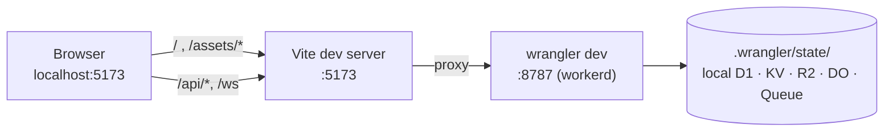
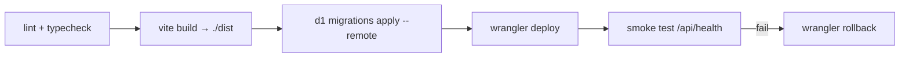

# Deployment

> From a clean checkout to a live URL: local dev topology, the full `wrangler.jsonc`, provisioning every binding, the deploy sequence, DNS/SSL/CDN, rollback, and observability.
>
> Start at [AGENT.md](../AGENT.md) · Related: [architecture.md](./architecture.md) · [database.md](./database.md) · [security.md](./security.md)

**Status:** Phase 1 done — `wrangler.jsonc`, `tsconfig.worker.json`, the Vite proxy, and the `worker:*`/`cf-typegen` scripts exist. `wrangler.jsonc` grows a binding per phase as each one lands (see the note in §4). The static-assets and production-deploy steps are **Phase 8**, still unbuilt.

---

## 1. Prerequisites

| Requirement | Version | Check |
| :--- | :--- | :--- |
| Node.js | 20 LTS or newer | `node --version` |
| npm | ships with Node | `npm --version` |
| Wrangler | **v4** | `npx wrangler --version` |
| Cloudflare account | Free tier is sufficient for everything except Queues¹ | — |

¹ **Queues requires a Workers Paid plan** ($5/month). This is the one hard cost in the project. Phases 1–5, 7 and 8 all work on the free tier; Phase 6 does not. Plan accordingly — see the cost table in §11.

```bash
npm install
npx wrangler login     # opens a browser; run it yourself, it is interactive
npx wrangler whoami    # confirms account and account_id
```

Wrangler is used via `npx` rather than installed globally, so the version is pinned by the repo rather than by whatever is on your machine.

---

## 2. Local development topology

Two processes. Vite serves the React app with HMR; `wrangler dev` runs the Worker in **workerd**, the same runtime as production, with Miniflare 3 emulating every binding locally.



### Scripts

`dev`, `build`, `lint`, and `preview` exist from Phase 0. **Phase 1 added:**

```jsonc
{
  "scripts": {
    "dev":          "vite",                                    // exists
    "build":        "tsc -b && vite build",                    // exists
    "lint":         "oxlint",                                  // exists
    "preview":      "vite preview",                            // exists

    "worker:dev":   "wrangler dev",                            // Phase 1
    "worker:check": "tsc -p tsconfig.worker.json --noEmit",    // Phase 1
    "cf-typegen":   "wrangler types",                          // Phase 1
    "db:migrate":   "wrangler d1 migrations apply devboard-db --local",   // Phase 2
    "db:migrate:remote": "wrangler d1 migrations apply devboard-db --remote",
    "db:studio":    "wrangler d1 execute devboard-db --local --command",   // Phase 2
    "deploy":       "npm run build && wrangler deploy"          // Phase 8
  }
}
```

Day-to-day you run two terminals: `npm run worker:dev` and `npm run dev`.

### The Vite proxy — Phase 1

`vite.config.ts` currently has no `server` block. Phase 1 adds one. The realtime route lives at `/api/ws` (see [architecture.md §6.4](./architecture.md#64-get-apiwsprojectid--upgrade-and-hand-off)), which already falls under the `/api` proxy entry — so that single entry needs `ws: true` too, or the WebSocket upgrade silently fails to proxy and Phase 5 appears broken for reasons that have nothing to do with Durable Objects. There is no separate `/ws` entry; nothing is served at a bare `/ws`.

```ts
// vite.config.ts — Phase 1 addition, ws:true added in Phase 5
export default defineConfig({
  plugins: [react(), tailwindcss()],
  resolve: {
    alias: { '@': path.resolve(import.meta.dirname, './src') },
  },
  server: {
    proxy: {
      '/api': { target: 'http://localhost:8787', changeOrigin: true, ws: true },
    },
  },
})
```

**In production there is no proxy.** One Worker serves the assets and the API from the same origin, so the paths that the proxy makes work locally are simply the real paths remotely. That symmetry is the point.

### `tsconfig.worker.json` — Phase 1

The Worker is a different runtime from the browser and needs its own compiler config. It must *not* pull in `lib: ["DOM"]` — that would let `document` and `window` typecheck in Worker code, which is exactly the mistake you want the compiler to catch.

```jsonc
{
  "compilerOptions": {
    "target": "es2022",
    "lib": ["ES2022"],
    "module": "esnext",
    "moduleResolution": "bundler",
    "types": ["@cloudflare/workers-types"],
    "strict": true,
    "noEmit": true,
    "skipLibCheck": true,
    "verbatimModuleSyntax": true,
    "noUnusedLocals": true,
    "noUnusedParameters": true
  },
  "include": ["worker", "worker-configuration.d.ts"]
}
```

`npx wrangler types` regenerates `worker-configuration.d.ts` from `wrangler.jsonc`. Run it after every binding change. **That file is generated — never edit it.**

Note: `@cloudflare/workers-types` v5+ (installed in this repo) dropped the dated subpath exports (`/2023-07-01`) in favour of a single rolling `types` entry point — use `["@cloudflare/workers-types"]`, not the dated path some older examples show.

---

## 3. What Miniflare emulates, and where local parity ends

Miniflare 3 runs actual workerd with local implementations of the bindings. This is genuinely high fidelity — far more than a mock layer — but it is not identical.

| Binding | Local behaviour | Fidelity |
| :--- | :--- | :--- |
| **D1** | Real SQLite file under `.wrangler/state/` | Very high. Same engine, same SQL |
| **KV** | Local key-value store with working TTLs | High — except it is **immediately consistent**, so eventual-consistency bugs stay hidden |
| **R2** | Local filesystem-backed object store | High |
| **Durable Objects** | Real DO semantics including hibernation | High |
| **Queues** | Local producer/consumer with batching and retries | Good; timing differs from production |
| **Static assets** | Served from `./dist` | High |

Where local dev **cannot** tell you the truth:

- **`request.cf` is `undefined`.** No `colo`, no `country`, no bot score. The Inspector bar shows `LOCAL`. Never write `request.cf.colo` without a guard, or Phase 1 works locally and 500s in production.
- **Turnstile** cannot verify against a real challenge. Use the documented test keys (see [security.md](./security.md#7-turnstile)) and be aware you are testing the plumbing, not the bot detection.
- **WAF and dashboard rate limiting** do not exist locally. Only the KV limiter runs.
- **KV consistency.** Local KV reads its own writes instantly. Production may take up to ~60 s to propagate globally. A cache-invalidation race that passes locally can still be wrong remotely.
- **Queue timing** is faster and more deterministic than production batching.
- **Latency** is ~0 ms. Every performance number you observe locally is fiction.

For KV and Queues specifically, `wrangler dev --remote` runs your code on Cloudflare's edge against real resources. Slower iteration, real behaviour. Use it before shipping any phase whose correctness depends on consistency or timing.

---

## 4. `wrangler.jsonc`

The whole configuration, annotated — this is the **target shape after all phases**, not what Phase 1 ships. In the repo, `wrangler.jsonc` stays minimal: each phase adds its own binding block for real when it lands, rather than carrying other phases' blocks pre-written and commented out. Commented-out JSON config isn't type-checked or linted by anything, so it's the kind of dead weight that silently drifts from what the code actually declares — the annotations below are a map of what's coming, not a template to paste in early.

```jsonc
{
  "$schema": "node_modules/wrangler/config-schema.json",
  "name": "devboard",
  "main": "worker/index.ts",
  "compatibility_date": "2025-09-01",
  "compatibility_flags": ["nodejs_compat"],

  // Phase 8 — one deploy ships the React build and the API together.
  "assets": {
    "directory": "./dist",
    "binding": "ASSETS",
    "not_found_handling": "single-page-application"
  },

  // Non-sensitive config only. Secrets go through `wrangler secret put`.
  "vars": {
    "ENVIRONMENT": "development",
    "TURNSTILE_SITE_KEY": "1x00000000000000000000AA"   // public by design
  },

  // Phase 2 — relational database.
  "d1_databases": [
    {
      "binding": "DB",
      "database_name": "devboard-db",
      "database_id": "<paste from `wrangler d1 create`>",
      "migrations_dir": "worker/db/migrations"
    }
  ],

  // Phase 3 — attachment bytes.
  "r2_buckets": [
    { "binding": "BUCKET", "bucket_name": "devboard-attachments" }
  ],

  // Phase 4 — cache, config, rate-limit counters.
  "kv_namespaces": [
    { "binding": "KV", "id": "<paste from `wrangler kv namespace create`>" }
  ],

  // Phase 5 — realtime coordination.
  "durable_objects": {
    "bindings": [
      { "name": "REALTIME_BOARD", "class_name": "RealtimeBoard" }
    ]
  },
  "migrations": [
    {
      "tag": "v1",
      // SQLite-backed DOs. `new_classes` (KV-backed) is legacy and unavailable
      // on the free plan — use `new_sqlite_classes`.
      "new_sqlite_classes": ["RealtimeBoard"]
    }
  ],

  // Phase 6 — async activity processing. Requires Workers Paid.
  "queues": {
    "producers": [
      { "binding": "ACTIVITY_QUEUE", "queue": "devboard-activity" }
    ],
    "consumers": [
      {
        "queue": "devboard-activity",
        "max_batch_size": 25,        // messages per queue() invocation
        "max_batch_timeout": 5,      // seconds to wait before flushing a partial batch
        "max_retries": 3,
        "dead_letter_queue": "devboard-activity-dlq"
      }
    ]
  },

  // Structured logs in the dashboard and via `wrangler tail`.
  "observability": {
    "enabled": true,
    "head_sampling_rate": 1
  }
}
```

### Things that will trip you

**`durable_objects` needs a matching `migrations` entry.** Declaring the binding alone deploys nothing. And the class must be exported from `worker/index.ts` — see [architecture.md §3](./architecture.md#3-why-hono).

**`new_sqlite_classes`, not `new_classes`.** SQLite-backed Durable Objects are the current default and the only kind available on the free plan. Getting this wrong produces a deploy error that does not obviously say so.

**`compatibility_date` is not a version to keep bumping casually.** It pins runtime behaviour. Change it deliberately, then re-run the full test suite.

**`nodejs_compat`** is included for a few polyfills Hono may reach for. It does not mean Node APIs are broadly available, and it is not a licence to `import fs`.

**Queue name vs. binding name.** `"binding"` is what you type in code (`env.ACTIVITY_QUEUE`); `"queue"` is the resource name in Cloudflare. They are intentionally different so the mapping is visible.

---

## 5. Provisioning

Run once per environment. Each command prints an id — paste it into `wrangler.jsonc` immediately, before you forget which is which.

```bash
# ---- D1 (Phase 2) ----
npx wrangler d1 create devboard-db
# → copy database_id into d1_databases[0].database_id

# ---- R2 (Phase 3) ----
npx wrangler r2 bucket create devboard-attachments
# no id to copy; the bucket name is the reference

# ---- KV (Phase 4) ----
npx wrangler kv namespace create KV
# → copy id into kv_namespaces[0].id
npx wrangler kv namespace create KV --preview
# → copy preview_id if you want a separate namespace for `wrangler dev --remote`

# ---- Queues (Phase 6, requires Workers Paid) ----
npx wrangler queues create devboard-activity
npx wrangler queues create devboard-activity-dlq

# ---- Secrets (Phase 2 / Phase 7) ----
openssl rand -base64 48 | npx wrangler secret put JWT_SECRET
npx wrangler secret put TURNSTILE_SECRET_KEY     # paste the production secret key

# ---- Regenerate types after any binding change ----
npx wrangler cf-typegen   # or: npx wrangler types
```

Durable Objects need no provisioning command — they are created by the deploy that declares them.

Verify:

```bash
npx wrangler d1 list
npx wrangler r2 bucket list
npx wrangler kv namespace list
npx wrangler queues list
npx wrangler secret list        # names only, never values
```

---

## 6. The deploy sequence

Order matters. Migrations run **before** the code that depends on them, so there is never a window where new code queries a column that does not exist.

```bash
# 1. Gates — never deploy something that has not passed these.
npm run lint
npm run build                 # tsc -b && vite build → ./dist
npm run worker:check          # tsc -p tsconfig.worker.json --noEmit

# 2. Schema first.
npx wrangler d1 migrations list  devboard-db --remote   # confirm what will apply
npx wrangler d1 migrations apply devboard-db --remote

# 3. Ship.
npx wrangler deploy

# 4. Smoke test.
curl -s https://devboard.<your-domain>/api/health
curl -sI https://devboard.<your-domain>/ | grep -i strict-transport
```



`wrangler deploy` uploads the Worker script *and* the `./dist` assets in one atomic version. There is no window where a new frontend is talking to an old API. This is a genuine advantage of the single-Worker model over a split frontend/backend deploy, and it is worth not giving up.

### Migration compatibility

Because migrations run before the deploy, **every migration must be backward-compatible with the currently-deployed code**. Adding a nullable column or a new table is safe. Dropping or renaming a column that live code still selects will break production for the seconds between step 2 and step 3.

For a breaking change, use the two-deploy dance:

1. Deploy code that tolerates both shapes → 2. Apply the migration → 3. Deploy code that uses only the new shape.

---

## 7. Environments

```jsonc
// wrangler.jsonc — appended
"env": {
  "staging": {
    "name": "devboard-staging",
    "vars": { "ENVIRONMENT": "staging" },
    "d1_databases": [
      { "binding": "DB", "database_name": "devboard-db-staging", "database_id": "…" }
    ],
    "r2_buckets":   [{ "binding": "BUCKET", "bucket_name": "devboard-attachments-staging" }],
    "kv_namespaces":[{ "binding": "KV", "id": "…" }],
    "routes": [{ "pattern": "staging.devboard.app", "custom_domain": true }]
  },
  "production": {
    "name": "devboard",
    "vars": { "ENVIRONMENT": "production" },
    "routes": [{ "pattern": "devboard.app", "custom_domain": true }]
  }
}
```

```bash
npx wrangler deploy --env staging
npx wrangler secret put JWT_SECRET --env staging      # secrets are per-environment
npx wrangler d1 migrations apply devboard-db-staging --remote
```

**Every environment gets its own D1 database, R2 bucket, KV namespace, and secrets.** A staging deploy that writes to production data is a category of accident worth designing out entirely. Note that named environments do **not** inherit top-level bindings in every case — declare them explicitly per environment rather than assuming.

---

## 8. DNS, SSL, and CDN

### Custom domain

The simplest path is a **Custom Domain** (not a Route): Cloudflare creates the DNS record, provisions the certificate, and points it at the Worker.

```jsonc
"routes": [{ "pattern": "devboard.app", "custom_domain": true }]
```

Or in the dashboard: **Workers & Pages → devboard → Settings → Domains & Routes → Add Custom Domain**. Requires the zone to be on Cloudflare. The certificate is issued automatically, usually within a minute.

| Concept | Use when |
| :--- | :--- |
| **Custom Domain** | The Worker *is* the site at that hostname. DNS + cert handled for you. This is DevBoard's case |
| **Route** | The Worker intercepts a path pattern in front of an existing origin |
| **`workers.dev` subdomain** | Free, instant, fine for testing. Disable it in production so there is one canonical origin |

### SSL/TLS

Set encryption mode to **Full (strict)**. There is no origin server behind the Worker, so "Flexible" buys nothing and only weakens things. Also enable:

- **Always Use HTTPS** — redirects http→https at the edge
- **HSTS** — belt and braces with the header the Worker sets (see [security.md §9](./security.md#9-security-headers)). Enable `preload` only when you are sure, because it is hard to undo
- **Minimum TLS 1.2**
- **HTTP/3 (QUIC)** and **0-RTT** — both free wins

### Caching

Static assets are handled by the `assets` binding: hashed filenames from Vite (`index-a3f9b2.js`) are immutable, so Cloudflare caches them aggressively and **your Worker is never invoked for them** — no CPU, no billing, no cold start.

What you must not do is let `/api/*` be cached. It is not by default (Cloudflare does not cache responses to requests with an `Authorization` header, and the Worker sets no cache headers), but make it explicit:

| Path | Cache rule |
| :--- | :--- |
| `/assets/*` | Cache everything, edge TTL 1 year, respect immutable |
| `/index.html` | Bypass, or a very short TTL — it points at the hashed bundles |
| `/api/*` | **Bypass cache**, always |
| `/api/ws` | Bypass — WebSocket upgrades are not cacheable |

Add the `/api/*` bypass as an explicit Cache Rule in the dashboard rather than relying on defaults.

---

## 9. Rollback

```bash
npx wrangler deployments list          # versions, timestamps, authors
npx wrangler rollback [<version-id>]   # defaults to the previous version
```

Rollback is near-instant and reverts the Worker script **and** its assets together.

**It does not revert D1 migrations.** This is the asymmetry that makes migration compatibility (§6) matter: code rolls back in seconds, schema does not roll back at all. Undoing a schema change means writing a new forward migration.

For an emergency without a good previous version, `wrangler delete` removes the Worker entirely — the nuclear option, mentioned only so you know it exists.

---

## 10. Observability

### Live logs

```bash
npx wrangler tail                                   # stream everything
npx wrangler tail --status error                    # errors only
npx wrangler tail --search "RATE_LIMITED"           # text filter
npx wrangler tail --format pretty
```

With `observability.enabled: true`, logs are also retained and queryable in the dashboard under **Workers & Pages → devboard → Logs**.

### Log structure

Log objects, not strings — the dashboard can filter on fields.

```ts
console.log({
  event: "task.status_changed",
  requestId: crypto.randomUUID(),
  userId: user.id,
  projectId,
  taskId,
  from, to,
  d1Duration: res.meta.duration,
  colo: c.req.raw.cf?.colo ?? "LOCAL",
});
```

Never log a password, a token, a hash, or a secret. Log the decision, not the material — see [security.md §12](./security.md#12-secrets).

### What to watch

| Signal | Where | Concerning when |
| :--- | :--- | :--- |
| Error rate | Workers Analytics | Any sustained non-zero 5xx |
| CPU time p99 | Workers Analytics | Approaching the limit — usually PBKDF2 under load |
| D1 `rows_read` | Your own log field | Sudden growth = a query stopped using an index |
| Queue backlog | Queues dashboard | Growing = the consumer cannot keep up |
| DLQ depth | Queues dashboard | **Any** message in the DLQ deserves investigation |
| KV cache hit ratio | Derive from `X-DevBoard-Cache` | Falling = TTL too short or over-eager invalidation |
| DO duration | Workers Analytics | High = a DO is not hibernating when it should |

---

## 11. Cost

Free-tier limits at the time of writing; check current Cloudflare pricing before relying on them.

| Service | Free tier | Paid ($5/mo Workers Paid) |
| :--- | :--- | :--- |
| **Workers** | 100k requests/day | 10M requests/mo included, then $0.30/M |
| **D1** | 5 GB, 5M rows read/day, 100k rows written/day | 25 B rows read/mo included |
| **R2** | 10 GB storage, 1M Class A ops, 10M Class B ops/mo | $0.015/GB/mo — **egress always $0** |
| **KV** | 100k reads, 1k writes, 1k deletes/day, 1 GB | $0.50/M reads |
| **Durable Objects** | SQLite-backed DOs available | Included in Workers Paid; billed on requests + duration |
| **Queues** | **Not available** | Included; 1M ops/mo then $0.40/M |
| **Turnstile** | 1M widget requests/mo | Same |
| **DNS / SSL / CDN** | Unlimited | Same |

**The R2 line is the one to notice.** Zero egress is the whole reason R2 exists as a category — serving 1 TB of attachment downloads from S3 would cost roughly $90 in bandwidth and from R2 costs $0. That is not a marginal difference, and it is why "just put the file in the database" or "just use S3" are both wrong answers here.

**Queues is the only hard paywall.** Phases 1–5, 7, 8 run entirely free. If you are staying on the free plan, Phase 6 can be simulated by calling the consumer function directly from the producer — you lose the actual asynchrony (which is the entire lesson), so this is a stopgap, not a substitute.

---

## 12. Pre-launch checklist

**Configuration**
- [ ] `wrangler.jsonc` has real ids for every binding — no `<paste …>` placeholders
- [ ] `compatibility_date` is deliberate
- [ ] `npx wrangler types` run after the last binding change; `worker-configuration.d.ts` committed
- [ ] `.dev.vars` gitignored; no secrets anywhere in the repo or its history

**Provisioning**
- [ ] D1, R2, KV, both queues created in the production account
- [ ] `JWT_SECRET` and `TURNSTILE_SECRET_KEY` set for production, distinct from staging
- [ ] Production Turnstile sitekey in `vars`, test key removed

**Gates**
- [ ] `npm run lint` clean
- [ ] `npm run build` clean
- [ ] `npm run worker:check` clean
- [ ] Test suite passing ([testing.md](./testing.md))

**Deploy**
- [ ] Remote migrations applied and `migrations list --remote` shows nothing pending
- [ ] `wrangler deploy` succeeded
- [ ] `/api/health` returns 200 on the real domain

**Edge**
- [ ] Custom domain resolves; certificate valid
- [ ] SSL mode Full (strict); Always Use HTTPS on; min TLS 1.2; HTTP/3 on
- [ ] Cache rule bypassing `/api/*`
- [ ] `workers.dev` subdomain disabled
- [ ] WAF rate-limiting rule on `/api/auth/*`

**Verify live**
- [ ] Register → login → create project → create task → move task
- [ ] Upload and download an attachment
- [ ] Stats show `MISS` then `HIT`; purge returns it to `MISS`
- [ ] Two windows: a change in one appears in the other
- [ ] An action produces an activity feed entry within seconds
- [ ] Rapid failed logins produce 429 with `Retry-After`
- [ ] `wrangler tail` shows structured logs and leaks nothing sensitive
