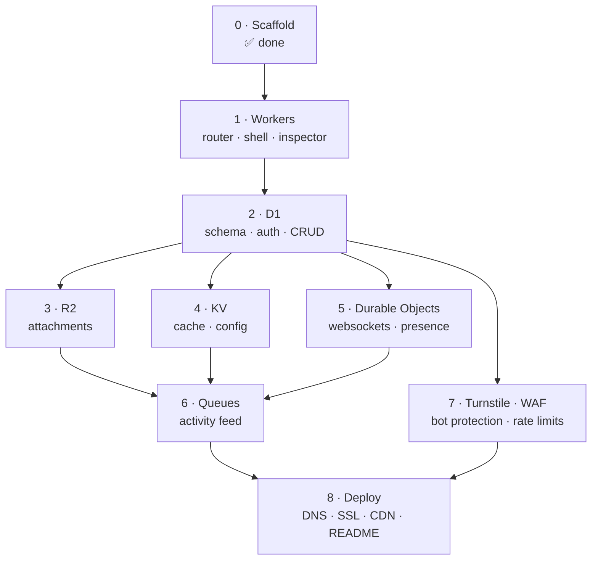

# Roadmap

> The eight build phases as trackable units: goal, deliverables, dependencies, exit criteria, and the specific thing each one teaches. Plus the post-v1 backlog and an honest list of where this gets hard.
>
> Start at [AGENT.md](../AGENT.md) · Related: [product.md](./product.md) · [testing.md](./testing.md)

---

## Status

Update this table in the same commit that completes a phase. It is the project's ground truth for "where are we".

| # | Phase | Primitive | Status |
| :---: | :--- | :--- | :--- |
| 0 | Frontend scaffold | — | ✅ **Done** |
| 1 | Worker, router, app shell | Workers | ✅ **Done** |
| 2 | Database, auth, tasks CRUD | D1 | ✅ **Done** (backend verified end-to-end; manual browser pass of M2 still outstanding) |
| 3 | File attachments | R2 | ⬜ Not started |
| 4 | Caching & edge config | KV | ⬜ Not started |
| 5 | Realtime collaboration | Durable Objects | ⬜ Not started |
| 6 | Activity feed | Queues | ⬜ Not started |
| 7 | Bot protection & rate limiting | Turnstile / WAF | ⬜ Not started |
| 8 | Production deployment | DNS / CDN / SSL | ⬜ Not started |

**Phase 0, already in the repo:** Vite 8 + React 19 + TypeScript 6, Tailwind v4 via `@tailwindcss/vite` with the full oklch token set in `src/index.css`, shadcn configured (`radix-luma`, `neutral`), one `Button` component, oxlint, `@/` path alias. No `worker/`, no `wrangler.jsonc`, no tests.

---

## Dependencies

Phase 2 is the chokepoint — nothing meaningful exists until there is a schema and a session. After it, **3, 4, 5, and 7 are independent** and can be built in any order or in parallel. Phase 6 needs 3, 4, and 5 only because its activity feed references attachments, invalidates caches, and broadcasts through the DO; the Queue mechanics themselves depend on none of them.

---

## Phase 1 — Workers: router, shell, inspector

**Goal.** A deployable Worker serving a React shell, with the Inspector bar reporting real edge metadata.

**Deliverables**
- `wrangler.jsonc` — name, main, compatibility date, observability. No storage bindings yet
- `tsconfig.worker.json` — Workers types, no DOM lib
- `worker/index.ts` — Hono app, CORS, timing middleware, `onError`
- `worker/env.ts` — `Env` and `Variables` interfaces
- `worker/lib/errors.ts` — `ApiError` + the JSON error envelope
- `GET /api/health`, `GET /api/info`
- `vite.config.ts` — proxy block for `/api` and `/ws` (`ws: true`)
- `package.json` — `worker:dev`, `worker:check`, `cf-typegen`
- `src/components/layout/Navbar.tsx`, `CloudflareBar.tsx`
- `src/api/client.ts` — typed fetch wrapper reading `X-DevBoard-*` headers

**Exit criteria**
- [ ] `npm run worker:dev` + `npm run dev`; `localhost:5173` renders the shell
- [ ] `/api/health` returns `{"status":"ok"}` through the proxy
- [ ] Inspector bar shows a duration and `LOCAL`
- [ ] `X-DevBoard-Colo` and `X-DevBoard-Duration` present **and in `Access-Control-Expose-Headers`**
- [ ] `npm run worker:check` and `npm run build` both clean
- [ ] Responsive 375–2560 px, no horizontal scroll
- [ ] Manual script M1 passes

**Learns.** V8 isolates vs. Node processes. The `fetch(request, env, ctx)` entrypoint. Why module scope is not a cache. `request.cf` and its absence locally. Hono on Web Standards.

**Watch for.** `request.cf` is `undefined` in dev — guard it or Phase 1 works locally and 500s in production. Custom headers are invisible to `fetch()` without `Access-Control-Expose-Headers`; this is an easy hour to lose.

---

## Phase 2 — D1: schema, auth, tasks

The largest phase. Consider splitting the commit into 2a (schema + auth) and 2b (CRUD + board).

**Goal.** Register, log in, create projects, create and move tasks, comment.

**Deliverables**
- `worker/db/migrations/0001_initial.sql` — five tables, indexes, constraints ([database.md §5](./database.md#5-0001_initialsql--phase-2))
- `worker/db/seed.sql`
- `worker/lib/password.ts` — PBKDF2 via `crypto.subtle`
- `worker/lib/jwt.ts` — HS256 sign/verify, hand-rolled
- `worker/lib/authz.ts` — `assertMembership`, plus `assertTaskMembership` for task/comment-scoped routes (see [security.md §6](./security.md#6-authorization))
- `worker/lib/position.ts` — `nextPosition`/`midpoint` fractional-indexing helpers (mirrored client-side in `src/lib/position.ts` so drag-and-drop can compute a position without a round trip; the two files are small, deliberate duplicates — `src/` and `worker/` are separate compilation targets)
- `worker/middleware/auth.ts`
- `worker/routes/auth.ts`, `projects.ts`, `tasks.ts` — `projects.ts` also exposes `GET /:id/members` (not in the original route table; needed so the UI can resolve assignee ids to names/avatars) and `GET /:id` gained a `memberCount` field
- `src/hooks/useAuth.ts`, `useProjects.ts`, `useTasks.ts`, `useComments.ts`, `useMembers.ts`
- `src/components/auth/LoginForm.tsx`, `RegisterForm.tsx`
- `src/components/kanban/Board.tsx`, `TaskCard.tsx`, `TaskModal.tsx`
- `src/components/layout/Sidebar.tsx`; `Navbar.tsx` extended with the project switcher, Board/Activity tabs (Activity disabled — no route until Phase 6), and the account menu, per [DESIGN.md §3](../DESIGN.md#3-app-shell)
- Drag-and-drop via `@dnd-kit/core` + `@dnd-kit/sortable` (chosen over hand-rolled native HTML5 DnD for built-in keyboard support and touch handling)
- shadcn: Dialog, Input, Label, Card, Avatar, Badge, DropdownMenu, Tabs, Sheet, Skeleton, and Sonner in place of Toast (this `components.json` style ships Sonner; `sonner`'s own theme detection was swapped for a `MutationObserver` on `<html class="dark">` since the app toggles dark mode by hand rather than through `next-themes`)
- *(no `cn` work needed — the `cn` package and the `@/lib/utils` re-export are already correct; see [design-system.md §9](./design-system.md#9-the-cn-utility))*
- vitest + `@cloudflare/vitest-pool-workers`; first unit and integration tests

**Post-Phase-2 architecture update.** Adopted at the user's request, after the phase's initial build:
- **`react-router`** replaces the plain conditional rendering App.tsx started with. URL structure: `/login`, `/register`, `/:projectSlug` (the board), `/:projectSlug/tasks/:taskId` (board + `TaskModal` open — same `Board` component, driven by the optional route param, so the modal is bookmarkable and browser-back closes it). Guarded by a `RequireAuth`/`PublicOnly` pair of route wrappers; `AuthenticatedShell` fetches the project list once and hands it to routed children via `Outlet` context so Navbar/Sidebar/Board agree on one list without introducing a separate global store for it.
- **`zod`** replaces the hand-rolled `worker/lib/validate.ts` (deleted) — `worker/lib/schemas.ts` now defines one schema per request body, parsed via `parseOrThrow()` which converts a `ZodError` into the same `ApiError(422, "VALIDATION_FAILED", …, { field })` shape the routes always returned. Mirrored (not imported) client-side in `src/lib/schemas.ts` for the auth forms and the project/task/comment quick-create inputs — same duplication rationale as `position.ts`.
- **`zustand`** replaces the hand-rolled pub/sub `src/lib/auth-store.ts` (deleted, moved to `src/stores/auth-store.ts`) for the auth session only, using its `persist` middleware for the `localStorage` round-trip that used to be hand-written. `useProjects`/`useTasks`/`useComments`/`useMembers` deliberately were **not** moved to zustand — they stay `useState`-in-a-hook, fetch-on-mount, with `useTasks`' optimistic-update/rollback contract unchanged.
- Fixed a real bug surfaced while testing the router change: `GET /api/health` and `/api/info` were being swallowed by `tasks.ts`'s `use("*", authMiddleware)` (re-based to `/api/*` once mounted at `/api` — Hono composes matching handlers in registration order, and the auth middleware was registered first). Fixed by registering the two public routes before the auth-requiring mounts in `worker/index.ts`; guarded by `test/integration/health.test.ts`.

**Exit criteria**
- [x] Register → login → reload keeps the session
- [x] Duplicate email → 409
- [x] Passwords stored only as PBKDF2 hash + per-user salt; verified by reading the table directly
- [x] Creating a project writes the project **and** the owner membership row in one `batch()`
- [x] Tasks create, edit, move, delete; order survives reload
- [x] Reordering writes one row, not the column
- [x] Non-member → **404**, not 403
- [x] JWT tests include `alg:none` and expiry rejection
- [ ] Manual script M2 passes — verified against a live `wrangler dev` instance via `curl` (M2 steps 1–4, 7) and the automated integration-test equivalent of steps 5–6 (reorder/move persistence); not run through the actual browser UI in this session (no connected browser) — worth a manual pass before calling the phase fully closed

**Learns.** D1 as real SQL at the edge. Prepared statements and `.bind()`. `batch()` as the whole transaction story. Web Crypto instead of bcrypt. Fractional indexing for ordering. Why authorization reads a membership table.

**Watch for.** Statements in a `batch()` cannot read each other's results — generate UUIDs in JS first. `verifyPassword` must run even for a nonexistent email, or response timing enumerates your users.

---

## Phase 3 — R2: attachments

**Goal.** Drop a file on a task; download it later; delete it cleanly.

**Deliverables**
- `0002_attachments.sql`
- `r2_buckets` binding
- `worker/routes/attachments.ts` — upload (streamed), download, delete, list
- Upload validation: 10 MB cap, MIME allow-list, **no SVG**
- Server-generated keys: `attachments/{projectId}/{taskId}/{uuid}{ext}`
- Task-deletion path that removes R2 objects before D1 rows
- Upload UI in `TaskModal` with `Progress`; drag-to-upload

**Exit criteria**
- [ ] Upload with progress; badge count increments
- [ ] Download sends the right filename and `Content-Disposition: attachment`
- [ ] Oversize → 413; SVG → 415
- [ ] Delete removes from R2 **and** D1; the URL then 404s
- [ ] Deleting a task cleans up its objects
- [ ] Body is streamed to R2, never buffered
- [ ] Manual script M3 passes

**Learns.** Why blobs live outside the relational database. R2's zero-egress model and what it replaces. Streaming request bodies. That "cascade" does not cross storage systems.

**Watch for.** R2 first, D1 second — the reverse leaves a metadata row pointing at nothing. `Content-Disposition: attachment` is a security control, not a convenience ([security.md §11](./security.md#11-upload-security)).

---

## Phase 4 — KV: caching and edge config

**Goal.** Stats load from cache, and the UI shows you that they did.

**Deliverables**
- `kv_namespaces` binding
- `worker/lib/cache-keys.ts` — every key built in one place
- `worker/lib/cache.ts` — `cacheAside()` helper
- `GET /api/projects/:id/stats` with `X-DevBoard-Cache`
- Invalidation on **every** mutating route
- `POST /api/projects/:id/cache/purge`
- `GET /api/config` reading `config:*`
- Inspector-bar cache pill + working Purge button

**Exit criteria**
- [ ] First load `MISS`, reload `HIT`, measurably faster
- [ ] Any task mutation makes the next load a `MISS`
- [ ] Purge button visibly works
- [ ] TTL expiry returns to `MISS` after 60 s
- [ ] **KV failing degrades to `BYPASS`, never a 500** — tested by mocking a rejection
- [ ] Only documented key prefixes exist in the namespace
- [ ] Manual script M4 passes

**Learns.** Cache-aside. Eventual vs. strong consistency, concretely. Why invalidation is the hard part. Using `ctx.waitUntil` so a cache write does not cost the user latency.

**Watch for.** Local KV is *immediately* consistent, so no local test can prove your invalidation is right. Verify against `wrangler dev --remote` before shipping. Prefer `delete` over overwriting on invalidation.

---

## Phase 5 — Durable Objects: realtime

**Goal.** Two people on one board see each other's changes instantly.

**Deliverables**
- `durable_objects` binding **plus** the `migrations` entry with `new_sqlite_classes`
- `worker/durable-objects/RealtimeBoard.ts` — hibernation API, presence, broadcast
- `RealtimeBoard` re-exported from `worker/index.ts`
- `worker/routes/ws.ts` — token verify, membership check, upgrade forward
- `POST /api/auth/ws-token` — 5-minute, project-scoped token
- Broadcast calls in every mutating route
- `src/hooks/useRealtime.ts` — backoff, `mutationId` echo suppression, reconnect resync
- Presence avatars; connection state in the Inspector bar

**Exit criteria**
- [ ] Two windows: a move in A appears in B under a second
- [ ] Comments propagate
- [ ] Presence appears and disappears correctly
- [ ] Killing the Worker shows reconnecting, not a crash; restart resyncs
- [ ] **The mutating client sees no flicker** from its own echo
- [ ] Hibernation test asserts the roster rebuilds from `getWebSockets()`
- [ ] Manual script M5 passes

**Learns.** Why stateless Workers cannot hold a WebSocket. `idFromName` as global coordination with no service discovery. The single-actor model. Hibernation and what it costs you.

**Watch for.** `new_sqlite_classes`, not `new_classes`. The DO class must be exported from the entrypoint. Instance fields do not survive hibernation — rebuild from `getWebSockets()`. The Vite proxy needs `ws: true`. Authorize in the Worker, before the DO.

---

## Phase 6 — Queues: activity feed

> **Requires a Workers Paid plan** ($5/mo). Queues is not on the free tier — the only hard cost in the project.

**Goal.** Actions produce feed entries a second or two later, with their own latency visible.

**Deliverables**
- `0003_activities.sql`
- `queues.producers` + `queues.consumers`; both queues created
- `worker/queue/consumer.ts` — batch insert, `ackAll`/`retryAll`, DLQ
- `queue()` exported from `worker/index.ts`
- Producer calls in every mutating route, carrying `occurredAt`
- Consumer broadcasts to the DO after writing
- `GET /api/projects/:id/activities` — cursor paginated
- `src/components/activity/ActivityFeed.tsx` with the Queue badge and latency chip
- Board/Activity `Tabs`

**Exit criteria**
- [ ] The API responds **before** the feed entry appears — the gap is visible and correct
- [ ] Entries carry the badge and a real `processed_at − occurred_at` latency
- [ ] Ten rapid actions arrive batched
- [ ] A forced consumer failure retries then dead-letters, and the user's original write is untouched
- [ ] Cursor pagination, no `OFFSET`
- [ ] Manual script M6 passes

**Learns.** Producer/consumer decoupling without infrastructure. Batching. At-least-once delivery and why duplicates are your problem. Retries, backoff, dead letters. Why ack granularity must match transaction granularity.

**Watch for.** `env.DB.batch()` is atomic, so per-message `ack()` is a lie — use `ackAll`/`retryAll`. Duplicates are possible by design; the deterministic-id fix is in the backlog below.

---

## Phase 7 — Turnstile, WAF, rate limiting

**Goal.** Auth endpoints survive scripted abuse.

**Deliverables**
- `worker/middleware/turnstile.ts` — server-side `siteverify`
- `worker/middleware/rate-limit.ts` — KV fixed-window limiter
- `worker/middleware/security-headers.ts` — CSP, HSTS, nosniff, referrer, frame, permissions
- Turnstile widget in both auth forms, with test keys for dev
- 429 UI with a live `Retry-After` countdown
- Dashboard WAF rate-limiting rule on `/api/auth/*`
- Tests: forged token, missing token, limiter trip, enumeration parity

**Exit criteria**
- [ ] Registration without a valid token → 403
- [ ] A replayed token → 403
- [ ] Six failed logins in a minute → 429 with `Retry-After`; UI counts down
- [ ] Security headers on every response
- [ ] **CSP verified live**: Turnstile renders, WebSocket connects, no console violations
- [ ] Login failure is identical for unknown email and wrong password, in copy and timing
- [ ] Manual script M7 passes

**Learns.** Why a client-side challenge result is worthless without server verification. Layered defence: edge WAF vs. application limiter. The real limits of a KV counter. CSP as a practical exercise rather than a header you copy.

**Watch for.** CSP must allow `challenges.cloudflare.com` in `script-src` **and** `frame-src`, and your `wss://` origin in `connect-src`. Miss either and the failure is silent. Rate limiting and the expensive PBKDF2 hash are a pair — without the limiter, your password security is a self-inflicted DoS.

---

## Phase 8 — Production

**Goal.** It is on the internet, on a real domain, over HTTPS.

**Deliverables**
- `assets` binding: `./dist`, SPA fallback
- `env.staging` / `env.production` with separate resources
- All production resources provisioned; secrets set
- Custom domain, Full (strict) SSL, HSTS, HTTP/3
- Cache rule bypassing `/api/*`
- `npm run deploy`
- **The comprehensive README** — the 18-section guide from the original plan
- Full manual pass M1–M9 against production

**Exit criteria**
- [ ] One `wrangler deploy` ships frontend and API atomically
- [ ] Custom domain, valid cert, `h3` negotiated
- [ ] Remote migrations applied; nothing pending
- [ ] Hashed assets cached long; `/api/*` not cached
- [ ] `wrangler tail` shows structured logs and leaks nothing
- [ ] `wrangler rollback` verified **before** it is needed
- [ ] Every checkbox in [deployment.md §12](./deployment.md#12-pre-launch-checklist)
- [ ] Every checkbox in [security.md §14](./security.md#14-pre-deploy-checklist)

**Learns.** Single-Worker deployment and why atomic frontend+API versioning matters. Static assets served without invoking your Worker. SSL modes when there is no origin. Migration/deploy ordering, and that code rolls back while schema does not.

---

## Post-v1 backlog

Not scheduled. Roughly ordered by value per unit of effort.

**Correctness and hardening**
- **Deterministic activity ids** — hash the message into the primary key + `INSERT OR IGNORE` for exactly-once feed entries
- **Durable Object rate limiter** — replaces the KV fixed-window counter with an accurate one, at one extra hop
- **Token revocation** — KV `jti` deny-list, +1 KV read per request
- **D1 Sessions API** — read-your-writes against read replicas
- **Activity retention** — a Cron Trigger pruning entries older than 90 days
- **Orphan sweep** — scheduled reconciliation of R2 objects with no D1 row

**Features**
- Project invitations (Phase 2 has membership but no invite flow — see [product.md §10](./product.md#10-open-product-questions))
- Task-level presence ("Alice is viewing task #4")
- Email notifications via **Email Workers**
- Daily digest via **Cron Triggers**
- Full-text search over tasks and comments (D1 FTS5)
- Task virtualisation for very large boards

**Platform exploration** — the natural next things to learn
- **Workers AI** — summarise a task's comment thread; suggest a title from a description
- **Analytics Engine** — write custom metrics and query them, replacing header-based observability with something real
- **Vectorize** — semantic search over tasks
- **Hyperdrive** — connect to an external Postgres, for contrast with D1
- **Browser Rendering** — generate board snapshot images
- **Workflows** — durable multi-step execution, versus the fire-and-forget Queue model

---

## Where this gets hard

Named in advance so they are recognised rather than discovered.

| Risk | Why it bites | Mitigation |
| :--- | :--- | :--- |
| **Cache invalidation** | Every new mutating route is a chance to forget a purge. The bug is invisible — stale data, no error | Route all keys through `cache-keys.ts`; assert invalidation in every mutation's test |
| **KV eventual consistency** | Local dev is immediately consistent, so the bug class cannot reproduce locally | Test Phase 4 against `wrangler dev --remote` before shipping |
| **DO hibernation** | Code that assumed an in-memory field survives works in dev and fails under real idle patterns | The hibernation test in [testing.md §6](./testing.md#6-durable-object-tests) |
| **Optimistic vs. realtime** | Two systems mutating the same state. Symptoms are flicker, double-apply, lost edits | The seven rules in [DESIGN.md §9](../DESIGN.md#9-optimistic-updates-and-realtime-reconciliation). Specify before building |
| **Queue retry storms** | A consumer failing on a poison message retries the whole batch forever | `max_retries: 3` + DLQ, from day one. Any DLQ message gets investigated |
| **Migration/deploy ordering** | Schema applies before code and cannot roll back | Every migration backward-compatible with deployed code; two-deploy dance for breaking changes |
| **CSP silently breaking things** | Turnstile and the WebSocket fail with errors that do not obviously say "CSP" | Verify live with the console open; the exact directives are in [security.md §9](./security.md#9-security-headers) |
| **PBKDF2 CPU cost** | 100k iterations under load can approach the Worker CPU limit | Rate limiting is not optional; the two controls are a pair |
| **Doc drift** | Ten documents describing unbuilt code will diverge from it | Update docs in the same commit as the code. The [AGENT.md](../AGENT.md) loop enforces it |

---

## Working a phase

1. Read the phase here — goal, deliverables, exit criteria, and the "watch for" list.
2. Read the doc that owns the detail (schema → [database.md](./database.md), routes → [architecture.md](./architecture.md), UI → [DESIGN.md](../DESIGN.md)).
3. Build the Worker side first, verified with `curl`. Then the UI.
4. Write tests as you go, not after — the seven-case route coverage in [testing.md §5](./testing.md#5-integration-tests--routes-against-real-bindings).
5. Run the gates: `npm run lint`, `npm run build`, `npm run worker:check`, `npm test`.
6. Run the phase's manual script (M1–M9).
7. Update any doc whose claims changed, and the status table above — **same commit**.
