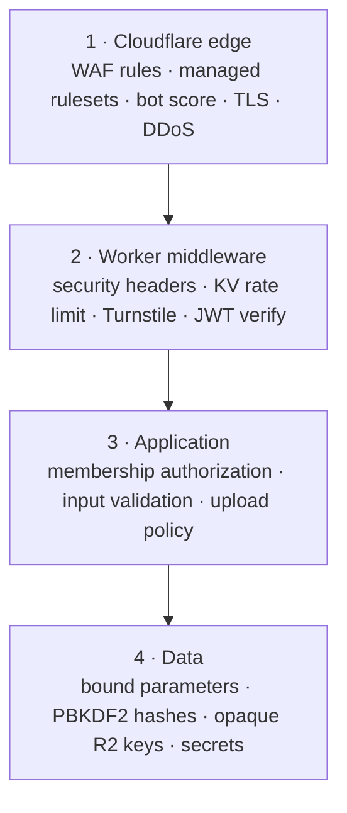
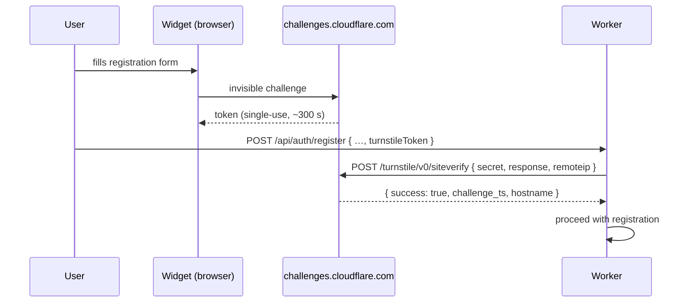

# Security

> The threat model, the four defensive layers, and exactly how authentication, authorization, bot protection, and rate limiting are implemented on the Workers runtime — plus an honest list of what this project does not do.
>
> Start at [AGENT.md](../AGENT.md) · Related: [architecture.md](./architecture.md) · [database.md](./database.md) · [deployment.md](./deployment.md)

**Status:** Specification. Auth lands in **Phase 2**; Turnstile, rate limiting, and headers in **Phase 7**.

---

## 1. Threat model

What DevBoard actually holds: email addresses, password hashes, project and task text, and uploaded files. No payment data, no PII beyond email, no regulatory scope. That calibrates the response — this is a small collaborative app, not a bank, and the controls below are proportionate to that.

| Threat | Likelihood | Impact | Primary control |
| :--- | :--- | :--- | :--- |
| Credential stuffing on `/api/auth/login` | High | Account takeover | Turnstile + KV rate limit + slow password hash |
| Scripted mass registration | High | Resource abuse, spam | Turnstile |
| Volumetric DDoS | Medium | Availability | Cloudflare edge, before your Worker runs |
| SQL injection | Medium | Total data compromise | Bound parameters, no exceptions |
| Broken object-level authorization (IDOR) | **High** | Cross-tenant data read | Membership check on *every* project-scoped route |
| Stored XSS via task/comment text | Medium | Session theft | React escaping + CSP; no `dangerouslySetInnerHTML` |
| XSS via uploaded HTML/SVG | Medium | Session theft | MIME allow-list + `Content-Disposition: attachment` |
| JWT forgery / algorithm confusion | Low | Full impersonation | Explicit HS256, algorithm asserted on verify |
| Token theft via XSS | Medium | Session theft | CSP; storage tradeoff documented below |
| Secret leakage into the repo | Medium | Everything | `wrangler secret`, gitignored `.dev.vars`, no secrets in `wrangler.jsonc` |
| Path traversal in R2 keys | Low | Object overwrite | Keys are server-generated UUIDs; user input never reaches them |
| User enumeration | Medium | Recon for the above | 404 not 403; identical timing and copy on login failure |

**The one to worry most about is IDOR.** Injection is prevented by a habit that is easy to keep. Broken authorization is prevented by remembering, on every single route, forever. It is the failure mode that actually ships.

---

## 2. Four layers



Each layer assumes the ones above it will sometimes fail. A WAF rule can be bypassed; the rate limiter still applies. The rate limiter can be evaded by rotating IPs; the password hash is still slow. Nothing here is load-bearing alone.

---

## 3. Password storage

No `bcrypt`, no `argon2` — those are native Node modules and do not run in a V8 isolate. The Workers runtime gives you Web Crypto, and **PBKDF2-SHA256 via `crypto.subtle` is the correct choice here**: it is available natively, it is a real password KDF (unlike a bare SHA-256), and its work factor is tunable.

```ts
// worker/lib/password.ts — Phase 2
const ITERATIONS = 100_000;   // OWASP floor for PBKDF2-SHA256; see note below
const KEY_LENGTH  = 32;       // bytes
const SALT_LENGTH = 16;       // bytes, unique per user

export async function hashPassword(
  password: string,
  salt?: Uint8Array,
): Promise<{ hash: string; salt: string }> {
  const saltBytes = salt ?? crypto.getRandomValues(new Uint8Array(SALT_LENGTH));

  const keyMaterial = await crypto.subtle.importKey(
    "raw",
    new TextEncoder().encode(password),
    "PBKDF2",
    false,
    ["deriveBits"],
  );

  const bits = await crypto.subtle.deriveBits(
    { name: "PBKDF2", salt: saltBytes, iterations: ITERATIONS, hash: "SHA-256" },
    keyMaterial,
    KEY_LENGTH * 8,
  );

  return { hash: toBase64(new Uint8Array(bits)), salt: toBase64(saltBytes) };
}

export async function verifyPassword(
  password: string,
  storedHash: string,
  storedSalt: string,
): Promise<boolean> {
  const { hash } = await hashPassword(password, fromBase64(storedSalt));
  return timingSafeEqual(hash, storedHash);
}

// Constant-time comparison. `a === b` short-circuits on the first differing
// byte and leaks how much of the hash you guessed correctly.
function timingSafeEqual(a: string, b: string): boolean {
  if (a.length !== b.length) return false;
  let diff = 0;
  for (let i = 0; i < a.length; i++) diff |= a.charCodeAt(i) ^ b.charCodeAt(i);
  return diff === 0;
}
```

**Rules:**

- Salt is 16 random bytes from `crypto.getRandomValues()`, unique per user, stored alongside the hash in `users.password_salt`. Never a global or derived salt.
- Iterations are a constant in one place. Raising it is a migration (re-hash on next successful login), so pick deliberately.
- Comparison is constant-time. This matters less than it sounds for a KDF output, and costs four lines.
- `verifyPassword` runs **even when the email does not exist**, against a dummy hash. Otherwise the response-time difference tells an attacker which emails are registered.

> **Iteration count and CPU budget.** 100,000 PBKDF2 iterations costs real CPU time inside the Worker's limit. It is comfortably affordable at DevBoard's scale, and it is precisely why login must be rate-limited: without a limiter, an attacker can turn your password security into a self-inflicted denial of service. The two controls are a pair.

---

## 4. Sessions: JWT via Web Crypto

### Structure

HS256, signed with `env.JWT_SECRET`. Hand-rolled in `worker/lib/jwt.ts` — a JWT library is ~40 lines of base64url and one `crypto.subtle.sign` call, and writing it is the point.

```jsonc
// payload
{
  "sub": "9c1f…",              // user id
  "email": "alice@example.com",
  "name": "Alice",
  "iat": 1757116800,
  "exp": 1757203200,           // iat + 24h
  "typ": "session"             // or "ws" — see §5
}
```

### Verification rules — all of them, every time

```ts
export async function verifyJWT(token: string, secret: string): Promise<JWTPayload> {
  const parts = token.split(".");
  if (parts.length !== 3) throw new ApiError(401, "INVALID_TOKEN", "Malformed token");

  const [headerB64, payloadB64, signatureB64] = parts;

  const header = JSON.parse(atob(base64UrlToBase64(headerB64)));
  // Algorithm confusion defence: never trust the header's choice, assert ours.
  if (header.alg !== "HS256") throw new ApiError(401, "INVALID_TOKEN", "Bad algorithm");

  const key = await crypto.subtle.importKey(
    "raw", new TextEncoder().encode(secret),
    { name: "HMAC", hash: "SHA-256" }, false, ["verify"],
  );

  const valid = await crypto.subtle.verify(
    "HMAC", key,
    fromBase64Url(signatureB64),
    new TextEncoder().encode(`${headerB64}.${payloadB64}`),
  );
  if (!valid) throw new ApiError(401, "INVALID_TOKEN", "Bad signature");

  const payload = JSON.parse(atob(base64UrlToBase64(payloadB64)));
  const now = Math.floor(Date.now() / 1000);
  if (payload.exp <= now) throw new ApiError(401, "TOKEN_EXPIRED", "Session expired");

  return payload;
}
```

The non-negotiables: **assert the algorithm** (never read `alg` and dispatch on it — that is how `alg: "none"` and RS256→HS256 confusion attacks work), **verify before parsing the payload for any purpose**, and **check `exp`**.

### Storage on the client — the actual tradeoff

| Option | XSS exposure | CSRF exposure | Works with WS query token? |
| :--- | :--- | :--- | :--- |
| `localStorage` | **Readable by any injected script** | Immune (not sent automatically) | Yes, trivially |
| `httpOnly` cookie | Not readable by script | Needs `SameSite` + CSRF token | Awkward |
| In-memory only | Smallest window | Immune | Yes, but lost on refresh |

DevBoard uses **`localStorage`**, and this is a deliberate, bounded decision: the app is a SPA calling a same-origin API with a bearer header, so CSRF is structurally absent, and the XSS exposure is mitigated by React's escaping plus a strict CSP. A production app holding sensitive data should use an `httpOnly` cookie with a CSRF token and accept the extra machinery.

**Consequence to accept: JWTs cannot be revoked.** Logout deletes the client's copy; a stolen token stays valid until `exp`. The 24-hour expiry is the mitigation. A real revocation story would be a KV deny-list of `jti` values checked in the auth middleware — one extra KV read per request. Listed post-v1 in [roadmap.md](./roadmap.md).

---

## 5. The WebSocket token problem

Browsers do not let you set headers on `new WebSocket(url)`. There is no `Authorization` header to send. The options are all imperfect:

| Approach | Problem |
| :--- | :--- |
| Session JWT in the query string | Ends up in access logs, referrers, browser history |
| `Sec-WebSocket-Protocol` abuse | Works, but is a hack that confuses proxies |
| Cookie | Requires the cookie session model we did not choose |
| **Short-lived dedicated token** | Extra round trip — and this is the one we take |

`POST /api/auth/ws-token` (authenticated normally, by header) returns a JWT with `typ: "ws"`, `exp` five minutes out, and the project id bound into it. The client passes *that* in the query string. If it leaks into a log, it is already expired and only ever granted read access to one project's socket.

```ts
// worker/routes/ws.ts — Phase 5
const payload = await verifyJWT(token, c.env.JWT_SECRET);
if (payload.typ !== "ws")        throw new ApiError(401, "INVALID_TOKEN", "Wrong token type");
if (payload.projectId !== projectId) throw new ApiError(403, "FORBIDDEN", "Token scope mismatch");

await assertMembership(c.env.DB, projectId, payload.sub);   // D1 check, still

const id   = c.env.REALTIME_BOARD.idFromName(projectId);
const stub = c.env.REALTIME_BOARD.get(id);
return stub.fetch(request);
```

**Authorization happens in the Worker, before the Durable Object is touched.** The DO trusts its caller absolutely — it has no cheap route to D1, and making it check would serialise every connection behind a database round trip. That trust is safe only because the *only* way to reach the DO is through this handler.

---

## 6. Authorization

Every project-scoped route asks the same question: *is this user a member of this project, with sufficient role?* One helper, used everywhere, no exceptions.

```ts
// worker/lib/authz.ts — Phase 2
const RANK = { viewer: 0, member: 1, admin: 2, owner: 3 } as const;

export async function assertMembership(
  db: D1Database,
  projectId: string,
  userId: string,
  minimum: keyof typeof RANK = "viewer",
): Promise<Role> {
  const row = await db
    .prepare("SELECT role FROM project_members WHERE project_id = ? AND user_id = ?")
    .bind(projectId, userId)
    .first<{ role: Role }>();

  // 404, not 403: "this exists but you cannot see it" is an existence oracle.
  if (!row) throw new ApiError(404, "NOT_FOUND", "Project not found");
  if (RANK[row.role] < RANK[minimum]) throw new ApiError(403, "FORBIDDEN", "Insufficient role");

  return row.role;
}
```

| Role | Read board | Create/edit tasks | Upload | Manage members | Delete project |
| :--- | :---: | :---: | :---: | :---: | :---: |
| `viewer` | ✓ | | | | |
| `member` | ✓ | ✓ | ✓ | | |
| `admin` | ✓ | ✓ | ✓ | ✓ | |
| `owner` | ✓ | ✓ | ✓ | ✓ | ✓ |

**Task- and comment-scoped routes must resolve upward.** `PATCH /api/tasks/:id` receives a task id, not a project id — so it joins to find the project and then checks membership, in one query:

```sql
SELECT t.*, pm.role
FROM tasks t
JOIN project_members pm ON pm.project_id = t.project_id AND pm.user_id = ?
WHERE t.id = ?;
```

No row means either the task does not exist or the user is not a member — both are 404, which is exactly right. **Never** fetch the task first and check membership second; that is two round trips and one forgotten `if` away from an IDOR.

Implemented as `assertTaskMembership(db, taskId, userId, minimum)` in `worker/lib/authz.ts`, added alongside `assertMembership` in Phase 2 — same rank table, same 404-over-403 semantics, and it returns the joined task row so callers don't re-query after authorizing.

---

## 7. Turnstile



```ts
// worker/middleware/turnstile.ts — Phase 7
export const turnstile = createMiddleware<{ Bindings: Env }>(async (c, next) => {
  const { turnstileToken } = await c.req.json<{ turnstileToken?: string }>();
  if (!turnstileToken) throw new ApiError(400, "TURNSTILE_MISSING", "Verification required");

  const form = new FormData();
  form.append("secret",   c.env.TURNSTILE_SECRET_KEY);
  form.append("response", turnstileToken);
  form.append("remoteip", c.req.header("CF-Connecting-IP") ?? "");

  const res = await fetch(
    "https://challenges.cloudflare.com/turnstile/v0/siteverify",
    { method: "POST", body: form },
  );
  const outcome = await res.json<{ success: boolean; "error-codes"?: string[] }>();

  if (!outcome.success) {
    console.warn("turnstile failed", outcome["error-codes"]);
    throw new ApiError(403, "TURNSTILE_FAILED", "Verification failed");
  }
  await next();
});
```

**The client-side token means nothing on its own.** It is an opaque string an attacker can copy out of a legitimate session. Only the server-side `siteverify` call — with your *secret* key, which the browser never sees — establishes anything. A client that checks the widget "passed" and posts without server verification has implemented decoration, not security.

Tokens are **single-use** and expire in ~300 seconds. A replayed token fails verification, which is the anti-automation property doing its job. The frontend must reset the widget after every submission, successful or not.

**Test keys** (documented by Cloudflare, safe to commit):

| Sitekey | Behaviour |
| :--- | :--- |
| `1x00000000000000000000AA` | Always passes (visible) |
| `2x00000000000000000000AB` | Always blocks |
| `3x00000000000000000000FF` | Forces an interactive challenge |

Secret key for testing: `1x0000000000000000000000000000000AA`. Local dev uses these; production keys are provisioned in the dashboard and set with `wrangler secret put TURNSTILE_SECRET_KEY`.

---

## 8. Rate limiting

Two independent mechanisms with different strengths. Use both.

| | **Dashboard WAF rate limiting** | **KV sliding window in the Worker** |
| :--- | :--- | :--- |
| Runs | Before your Worker | Inside your Worker |
| Costs you | Nothing — request is dropped at the edge | A KV read + write, ~2 ms |
| Granularity | IP, path, header, country | Any key you can compute — user id, email, project |
| Accuracy | Cloudflare's own counters | Eventually consistent, so approximate |
| Configured in | Dashboard / Terraform | Code you can test |

The dashboard rule is the blunt outer wall; the KV limiter is the precise inner one that can say "five failed logins **for this email address**".

### The implementation

```ts
// worker/middleware/rate-limit.ts — Phase 7
export function rateLimit(opts: { scope: string; limit: number; windowSeconds: number }) {
  return createMiddleware<{ Bindings: Env }>(async (c, next) => {
    const ip = c.req.header("CF-Connecting-IP") ?? "unknown";
    const now = Math.floor(Date.now() / 1000);
    const window = Math.floor(now / opts.windowSeconds);
    const key = cacheKeys.rateLimit(opts.scope, ip, window);

    const count = Number((await c.env.KV.get(key)) ?? 0);

    if (count >= opts.limit) {
      const retryAfter = (window + 1) * opts.windowSeconds - now;
      c.header("Retry-After", String(retryAfter));
      c.header("X-RateLimit-Limit", String(opts.limit));
      c.header("X-RateLimit-Remaining", "0");
      throw new ApiError(429, "RATE_LIMITED", `Too many requests. Retry in ${retryAfter}s.`);
    }

    // expirationTtl covers two windows so the current bucket cannot vanish mid-window.
    c.executionCtx.waitUntil(
      c.env.KV.put(key, String(count + 1), { expirationTtl: opts.windowSeconds * 2 }),
    );
    c.header("X-RateLimit-Remaining", String(opts.limit - count - 1));
    await next();
  });
}
```

### Limits

| Route class | Limit | Window | Key |
| :--- | ---: | ---: | :--- |
| `POST /api/auth/login` | 5 | 60 s | IP **and** separately, email |
| `POST /api/auth/register` | 3 | 300 s | IP |
| `POST /api/tasks/:id/attachments` | 20 | 60 s | user id |
| All other mutations | 100 | 60 s | user id |
| Reads | — | — | Dashboard WAF only |

### Be honest about its limits

This is a **fixed-window counter**, not a true sliding window. An attacker who sends 5 requests at `t=59` and 5 more at `t=61` gets 10 through in two seconds. Tightening that means storing timestamps per key and doing more work per request.

Worse, **KV's eventual consistency means the count can be stale.** Two requests hitting different colos concurrently may both read `4` and both write `5`, so the true count drifts under distributed attack. And KV rate-limits writes to the same key at roughly 1/s.

Both facts are acceptable *because this is defence in depth*: the limiter's job is to stop casual scripted abuse and to blunt the CPU cost of PBKDF2. Volumetric attacks are the WAF's job. A precise limiter would use a Durable Object as a single-threaded counter — correct, and one more hop per request. That trade is listed in [roadmap.md](./roadmap.md).

---

## 9. Security headers

Applied by middleware to every response.

```ts
// worker/middleware/security-headers.ts — Phase 7
const CSP = [
  "default-src 'self'",
  "script-src 'self' https://challenges.cloudflare.com",
  "frame-src https://challenges.cloudflare.com",
  "style-src 'self' 'unsafe-inline'",              // Tailwind injects styles
  "img-src 'self' data: blob:",                    // attachment previews
  "font-src 'self' data:",                         // Inter is bundled, not from a CDN
  "connect-src 'self' wss://*.devboard.app",       // the WebSocket
  "object-src 'none'",
  "base-uri 'self'",
  "form-action 'self'",
  "frame-ancestors 'none'",
].join("; ");
```

| Header | Value | Stops |
| :--- | :--- | :--- |
| `Content-Security-Policy` | above | XSS payload execution and exfiltration |
| `Strict-Transport-Security` | `max-age=31536000; includeSubDomains; preload` | Protocol downgrade |
| `X-Content-Type-Options` | `nosniff` | MIME sniffing an upload into a script |
| `Referrer-Policy` | `strict-origin-when-cross-origin` | URL leakage |
| `X-Frame-Options` | `DENY` | Clickjacking (belt to CSP's braces) |
| `Permissions-Policy` | `geolocation=(), microphone=(), camera=()` | Unused capability surface |

**The three CSP entries that will bite you.** `script-src` and `frame-src` must include `challenges.cloudflare.com` or the Turnstile widget silently fails to render. `connect-src` must include the `wss://` origin or the WebSocket is blocked with a console error that does not obviously mention CSP. Both are documented here because both cost an hour to rediscover.

`style-src 'unsafe-inline'` is a real weakening, forced by Tailwind's runtime style injection. Nonce-based styles would be the stricter answer and are not worth the build complexity at this scale — noted, not hidden.

---

## 10. Input validation

Validate at the boundary, in the route handler, before anything touches a store.

| Field | Rule |
| :--- | :--- |
| `email` | RFC-shaped, ≤ 254 chars, lowercased and trimmed before use |
| `password` | 8–200 chars. Length is the only requirement that measurably helps; composition rules push users to `Password1!` |
| `displayName` | 1–60 chars, trimmed, must not be only whitespace |
| `title` | 1–200 chars |
| `description`, `body` | ≤ 10,000 chars |
| `status`, `priority`, `role` | Exact match against the enum — the same values as the D1 `CHECK` constraints |
| Any id | UUID v4 shape before it reaches a query |
| `position` | Finite number, not `NaN`/`Infinity` |

Reject with **422** and a `details.field` so the UI can attach the message to the right input.

**Do not sanitise HTML out of user text.** React escapes on render, which is the correct and complete defence for text content. Stripping tags server-side corrupts legitimate content ("use `<div>` for the wrapper") and creates a false sense of safety. The single hard rule that makes this work: **`dangerouslySetInnerHTML` never appears in this codebase.**

---

## 11. Upload security

Untrusted files are the sharpest edge in the app.

| Control | Rule | Why |
| :--- | :--- | :--- |
| Size | 10 MB per file, enforced via `Content-Length` **and** by counting bytes as the stream is consumed | A lying `Content-Length` is trivial |
| MIME allow-list | `image/png`, `image/jpeg`, `image/gif`, `image/webp`, `application/pdf`, `text/plain`, `text/markdown`, `application/zip`, `text/csv`, `application/vnd.ms-excel` (`.xls`), `application/vnd.openxmlformats-officedocument.spreadsheetml.sheet` (`.xlsx`) | An allow-list fails closed; a block-list fails open |
| **No SVG** | Excluded from the allow-list | SVG is an XML document that can carry `<script>`. It is an XSS vector wearing an image costume |
| Extension | Derived from the validated MIME type, not from the filename | Filename is user input |
| Object key | `attachments/{projectId}/{taskId}/{uuid}{ext}` — fully server-generated | No traversal, no collision, no overwrite of someone else's object |
| `Content-Disposition` | `attachment; filename="…"` on every download, always | Forces a download instead of rendering in the origin. Neutralises stored HTML/SVG XSS |
| `X-Content-Type-Options` | `nosniff` on downloads | Stops the browser second-guessing the declared type |
| Filename in the header | Quotes and control characters stripped; RFC 5987 `filename*` for non-ASCII | Header injection |
| Authorization | D1 membership check before `env.BUCKET.get()` | R2 keys are unguessable, but obscurity is not authorization |

Full key layout in [database.md §8](./database.md#8-r2-object-layout).

---

## 12. Secrets

| Secret | Set with | Local |
| :--- | :--- | :--- |
| `JWT_SECRET` | `npx wrangler secret put JWT_SECRET` | `.dev.vars` |
| `TURNSTILE_SECRET_KEY` | `npx wrangler secret put TURNSTILE_SECRET_KEY` | `.dev.vars` (test key) |

```ini
# .dev.vars — gitignored, never committed
JWT_SECRET="local-development-only-not-a-real-secret"
TURNSTILE_SECRET_KEY="1x0000000000000000000000000000000AA"
```

Rules:

- **`wrangler.jsonc` is committed, so it holds no secrets.** Its `vars` block is for non-sensitive configuration only (`ENVIRONMENT`, the Turnstile *sitekey*, which is public by design).
- `.dev.vars` and `.dev.vars.*` must be in `.gitignore` before the first one is created.
- Generate `JWT_SECRET` with `openssl rand -base64 48`. Different value per environment.
- Rotating `JWT_SECRET` invalidates every session immediately. That is the emergency lever; know it exists.
- Secrets are write-only after being set — `wrangler secret list` shows names, never values.
- Never `console.log` a secret, a token, or a password. Log the *decision* ("auth failed: bad signature"), never the material.

---

## 13. Deliberate gaps

These are absent by choice, not oversight. Documented so nobody mistakes the list for a complete security posture.

| Not implemented | Consequence | Would need |
| :--- | :--- | :--- |
| Email verification | Anyone can register any address | Email Workers or an external provider |
| Password reset | A forgotten password is a lost account | Email delivery + single-use reset tokens |
| MFA / TOTP | Password alone is the whole factor | WebAuthn or TOTP + recovery codes |
| Token revocation | Logout is client-side; a stolen JWT lives to `exp` | KV `jti` deny-list, +1 KV read per request |
| Refresh tokens | 24 h expiry forces a re-login | Rotating refresh token + storage |
| Audit log | `activities` is a product feature, not a tamper-evident security log | Append-only store, integrity chaining |
| Virus scanning | Uploads are unscanned | Third-party scanning on the upload path |
| Per-tenant isolation | One flat user space | Real multi-tenancy |
| Field encryption at rest | D1 is encrypted at rest; individual fields are not | App-level envelope encryption |
| Precise rate limiting | Fixed-window, eventually consistent (§8) | A Durable Object counter |
| CSP without `unsafe-inline` | Weakened style policy (§9) | Nonce plumbing through the build |

---

## 14. Pre-deploy checklist

Run through this before any `wrangler deploy` to production.

- [ ] No secrets in `wrangler.jsonc`, source, or git history
- [ ] `.dev.vars` gitignored and never committed
- [ ] `JWT_SECRET` set in production, distinct from every other environment, ≥ 32 bytes of entropy
- [ ] Production Turnstile keys set; test keys not in use
- [ ] Every project-scoped route calls `assertMembership` — grep the route files and count
- [ ] No string interpolation anywhere in a SQL statement — `grep -rn 'prepare(`' worker/` and read every hit
- [ ] No `dangerouslySetInnerHTML` in `src/`
- [ ] Security headers present on a real response (`curl -sI`)
- [ ] CSP verified against a live page: Turnstile renders, WebSocket connects, no console violations
- [ ] Rate limits verified by actually tripping them
- [ ] Uploads: oversize rejected, disallowed MIME rejected, download sends `Content-Disposition: attachment`
- [ ] Login failure for a nonexistent email is indistinguishable from a wrong password, in both copy and timing
- [ ] Non-member access to a project returns 404, not 403
- [ ] Dashboard WAF rate-limiting rule active on `/api/auth/*`
- [ ] `wrangler tail` on a failed login shows no password, token, or hash material
